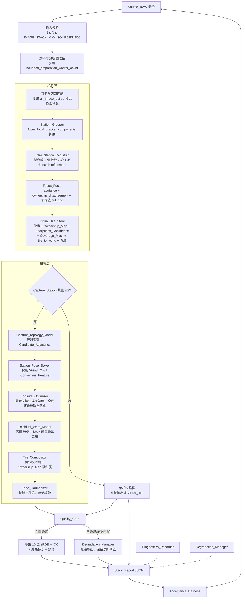

# Design Document

## Overview

本设计把当前混在一条 mosaic 流程里的「机位内焦平面选择」与「机位间几何拼接」拆成两层，
并且是**在现有代码上做增量改造**：现有的证据驱动分组、原生分辨率 patch refinement、
acutance 清晰度度量、`seam_cut::cut_grid` 图割、photometric 低频增益求解、流式分块画布
都保留并复用；新增的是显式的 Virtual_Tile 数据结构与缓存、Quality_Gate、Stack_Report、
受约束残差形变模型，以及把现有的诊断开关改造成默认路径。

### 两层架构与现有单层 mosaic 流程的关系

现有 `stitch_images_with_options` 在 `BlendMode::FocusStack` 下已经有一条虚拟瓦片路径
（`panorama_stitching.rs` 约 6930–7150 行）：

1. `solve_focus_capture_group_poses()` 已经把源图聚成 `FocusCaptureGroup`（= Capture_Station），
   并求解机位级位姿；
2. `stitching::focus_stack_virtual_tile_geometry()` 先只算瓦片几何（宽高 + `tile_to_world`），
   不解码像素；
3. 每个机位通过 `load_tile` 闭包按需调用 `stitching::focus_stack_stitcher_unfilled()` 做机位内
   景深合成，产出一张瓦片像素；
4. 瓦片被包装成合成的 `ImageInfo`（`id = usize::MAX - group_index`，
   `filename = "virtual://focus-group-N-..."`），交给瓦片级合成器。

**需求文档引言在这一点上需要修正**：虚拟瓦片路径已经是默认路径，
`RAW_EDITOR_USE_STREAMING_VIRTUAL_TILE_MOSAIC` 和 `RAW_EDITOR_USE_OWNERSHIP_VIRTUAL_TILE_STITCHER`
切换的是**瓦片级合成器的选择**，不是「是否启用虚拟瓦片」：

| 开关状态                                         | 实际走的瓦片合成器                                         |
| ------------------------------------------------ | ---------------------------------------------------------- |
| 两者都未设置（默认）                             | `stitching::progressive_seam_stitcher`                     |
| `RAW_EDITOR_USE_STREAMING_VIRTUAL_TILE_MOSAIC`   | `mosaic::detail_preserving_mosaic`                         |
| `RAW_EDITOR_USE_OWNERSHIP_VIRTUAL_TILE_STITCHER` | `stitching::focus_tile_ownership_stitcher`                 |
| 上述任一失败                                     | 回退 `stitching::focus_stack_stitcher`（真正的旧单层路径） |

因此需求 15.2 的落地动作不是「把虚拟瓦片从开关后面搬出来」，而是：
**把 ownership 语义的瓦片合成器定为默认，把 `progressive_seam_stitcher` 与
`detail_preserving_mosaic` 降级为诊断开关**，并保留 `focus_stack_stitcher` 作为
需求 15.3/15.10 的「旧单层 mosaic 对照路径」。

### 本次调研发现的、直接对应 `docs/focus-stack-reference-validation.md` 四项失败的根因

| 文档记录的失败        | 调研定位的根因                                                                                                                                                                                                                                                 |
| --------------------- | -------------------------------------------------------------------------------------------------------------------------------------------------------------------------------------------------------------------------------------------------------------- |
| 裁掉画框              | `progressive_seam_stitcher`（默认路径）在 `valid_coverage < 0.995` 时调用 `crop_to_valid_rectangle()`，即「最大全有效矩形」裁切（`stitching.rs` 约 1394–1399）。`mosaic.rs` 的 `mask_covered_bounds` 路径才保留联合边界。                                      |
| 失焦 / 画质被二次处理 | `progressive_seam_stitcher` 默认执行 `sharpen_focus_tile_detail(.., 0.42)`（`RAW_EDITOR_FINAL_PANORAMA_SHARPEN_AMOUNT` 缺省 0.42），用锐化补偿两级重采样的锐度损失。这既破坏「像素来自真实照片」，也让 Noise_Sigma 比值不可控。                                |
| 分区接缝              | 瓦片级接缝在 `progressive_seam_stitcher` 中按「先放基准、逐张叠加」的顺序进行，接缝代价不含「到有效覆盖边界的距离」项；`focus_tile_ownership_stitcher` 的源内部 ownership 又会把投影梯形直接变成可见多边形（代码注释已记录）。                                 |
| 错位                  | 机位间关系的接受门槛过松：`FOCUS_GROUP_CONSENSUS_MAX_ERROR_RATIO = 0.006`，在 9504px 长边上约等于 57 个世界像素，而需求 6.3/7.6 要求 3.0 / 2.0 个世界像素；闭环修正上限 `FOCUS_GROUP_MAX_CENTER_CORRECTION_RATIO = 0.50` 约等于 4752px，需求 7.4 要求 ≤256px。 |

### 核心设计决策

**决策 1：保留两级重采样，删除默认锐化，代之以整数平移快路径 + 高质量重采样 + Quality_Gate 验证。**
需求 8.7 只约束「Virtual_Tile 从机位坐标到世界坐标」的重采样不超过 1 次，现状满足。
源图 → 机位平面是第 2 次采样，但需求 2.1 已规定锚点帧变换为恒等，因此锚点帧拥有的像素是
逐字节复制。改造为：当 `tile_to_world` 是整数平移且无残差形变时，瓦片 → 画布按整数偏移
直接拷贝，不做插值；否则使用既有 `get_high_quality_interpolated_pixel()`（Catmull-Rom 带
局部 min/max 钳制）。默认锐化量改为 0.0，环境变量仅保留给诊断对照。锐度由需求 11.6 的
MTF50_Normalized ≥ 0.93 与 11.7 的梯度能量 ≥ 0.95 验证，而不是由锐化掩盖。

**决策 2：ownership 决策与像素写入分离。**
`Focus_Fuser` 只在 ownership 单元网格上做决策（复用 `seam_cut::cut_grid`），
像素写入阶段严格按 `Ownership_Map` 复制被选中帧的像素，不做任何 owner 之间的加权平均，
也不写过渡混合带（需求 3.6）。现有 `STREAMING_OWNERSHIP_FEATHER = 0.65` 的亚单元抗锯齿
被移除，改为在 ownership 网格分辨率（约 19 个原生像素/单元）上直接硬边，
接缝的平滑性由图割的平滑项承担，而不是由 alpha 过渡承担。

**决策 3：多标签图割用「基准 + 候选」的顺序二值割实现（alpha-expansion 风格），复用现有
`cut_grid`。** 现有 `cut_grid` 是 `f64` 容量的 Dinic 二值割，已有与穷举最小值对齐的单元测试。
多焦平面的多标签 ownership 通过按帧顺序反复执行「当前底图 vs 下一候选」的二值割实现；
帧顺序由确定性规则给出（锚点帧优先，其余按中位 Sharpness_Score 降序，同值按绝对路径升序），
从而保证需求 14.6 的可复现性和需求 3.4 的「每个已覆盖单元恰好一个 owner」。

**决策 4：色调协调放在接缝与 ownership 全部确定之后（需求 9.5/9.6），且只作用于低频带。**
复用 `panorama_utils/photometric.rs` 的增益求解（它已经是「同一世界位置的对应像素」采样、
MAD 一致性、log 增益钳制的实现），把它的调用从 `RAW_EDITOR_ENABLE_GLOBAL_PHOTOMETRIC`
开关后面移到默认路径，并把 `PhotometricOptions` 的约束值改成需求 9.3 的范围。

**决策 5：Stack_Report 是一等公民，所有阈值判定都写入同一份 JSON。**
现有代码用 `println!` 输出诊断，测试靠 `--nocapture` 抓文本。新增 `Stack_Report` 结构后，
所有现有 `println!` 诊断行保留（人读方便），但**判定**只依据 Stack_Report 字段，
使需求 15.9 的常规回归可以在不读 RAW 的条件下断言结构与阈值。

### 增量迁移策略

1. **不新建并行流程。** 所有新增组件都挂在现有 `stitch_images_with_options` →
   `BlendMode::FocusStack` 分支上，`solve_focus_capture_group_poses()` 的返回值与
   `focus_stack_virtual_tile_geometry()` 的签名保持向后兼容。
2. **先加观测，再改行为。** 第一阶段只引入 Stack_Report 和 Quality_Gate 的「记录但不阻止」
   模式，让阆苑女仙 84 张回归先产出可读数字，再按数字收紧阈值。
3. **旧路径可对照。** `focus_stack_stitcher`（单层）与两个现有瓦片合成器都保留，
   通过一个统一的诊断开关选择，默认关闭（需求 15.3/15.10）。
4. **常量不重复定义。** 现有常量（`SELECTION_LONG_SIDE`、`NATIVE_REFINE_STEP`、
   `OWNERSHIP_MISMATCH_PENALTY`、`FOCUS_BRACKET_MAX_COMPONENT_SOURCES` 等）就地调整，
   不新建同义常量，避免 `tests/focus-stack-quality-contract.mjs` 的源码级断言失效。

## 现状盘点：需求 1–15 与现有实现的对应

结论分三类：**复用**（现有实现已满足需求，只需接线与上报）、
**扩展**（现有实现方向正确但阈值/统计量/覆盖面不足）、**新增**（现在没有）。

| 需求                   | 现有实现位置                                                                                                                                                                                                                                                                             | 现状要点                                                                                                                                                                                                                                                                                                                                                                                                                                                                                                                                                                                                                                                                             | 结论                               |
| ---------------------- | ---------------------------------------------------------------------------------------------------------------------------------------------------------------------------------------------------------------------------------------------------------------------------------------- | ------------------------------------------------------------------------------------------------------------------------------------------------------------------------------------------------------------------------------------------------------------------------------------------------------------------------------------------------------------------------------------------------------------------------------------------------------------------------------------------------------------------------------------------------------------------------------------------------------------------------------------------------------------------------------------ | ---------------------------------- |
| 1 机位分组             | `panorama_stitching.rs::focus_local_bracket_components()` / `focus_match_is_capture_station_link()` / `split_focus_local_component_by_motion()` / `focus_capture_groups()`                                                                                                               | DSU 成员判定已是纯图像证据（内点数、焦段兼容、中心位移、重叠支持），组内排序已改为世界中心排序、文件名仅作 tie-break。但门槛是 `FOCUS_LOCAL_MODEL_MIN_INLIERS = 6`（需求要 ≥30）、`FOCUS_BRACKET_MIN_OVERLAP_SUPPORT = 0.60`（重叠面积比，不是 NCC ≥ 0.6）、无尺度比 `[0.98, 1.02]` 检查、`FOCUS_BRACKET_MAX_CENTER_MOTION_RATIO = 0.075`（需求 1.4 要 0.02 且为**累计**位移）。`FOCUS_BRACKET_MAX_COMPONENT_SOURCES = 48` 与需求 1.5/1.10 完全一致。孤立/解码失败源图当前只是被跳过，无上报。                                                                                                                                                                                       | 扩展                               |
| 2 机位内配准           | `panorama_utils/mosaic.rs::refine_native_layer()`、`panorama_utils/registration.rs::refine_warped_patch()`、`scalable_alignment_budget()`                                                                                                                                                | `NATIVE_REFINE_STEP = 16` 是分析坐标步长，原生间距由分析缩放换算并受 `s ≤ min(112px, 8c)` 约束；57×57 patch ≥ 32px；`refine_warped_patch(.., 10, 7)` 搜索半径 10 ≤ 64；双向一致性阈值 0.40px 比需求 2.4 的 1.0px 更严。缺：锚点帧选择规则（现在是 `group.members[0]`，按世界中心排序的第一个，不是中位 Sharpness_Score 最高）、8 邻域中位数一致性（需求 2.5）、逐帧回退（需求 2.7）、内点空间覆盖率统计（需求 2.8/2.9）。分析分辨率来自 `scalable_alignment_budget()` 的 2400/1800/1536，需求 2.2 要 ≤2048。`refine_native_layer` 有 `if sampler.scale <= 2.0 { return; }` 早退，且只在 mosaic 路径生效。                                                                            | 扩展                               |
| 3 景深合成与 ownership | `mosaic.rs::acutance()` / `cell_focus()` / `streaming_acutance()` / `ownership_disagreement()` / `ownership_grid()`，`seam_cut.rs::cut_grid()`                                                                                                                                           | `acutance()` 已经是「二项式 [1,4,6,4,1] 低通后、相隔 4 个原生像素的梯度能量、亮度 + (R−G)/2 + (B−G)/2 三通道、按局部电平归一化」，与 Glossary 的 Sharpness_Score 定义一致，但**未归一化到 `[0, 1]`**。`cell_focus()` 已是中心 + 四角 5 探针，但窗口约 13px，需求 3.2 要 32px。`SELECTION_LONG_SIDE = 512` 恰好满足需求 3.1 的「长边不少于 512 个单元」，在 9504px 层上 ≈ 19px/单元，落在 8–64 内。`OWNERSHIP_MISMATCH_PENALTY = 2.4` ≥ 需求 3.3 的 1.0。`cut_grid()` 是二值割，需要包成多标签。缺：Sharpness_Confidence、Coverage_Mask、低清晰度区域上报、120 秒超时降级、单帧机位短路。                                                                                             | 扩展                               |
| 4 Virtual_Tile 与溯源  | `stitching.rs::FocusVirtualTile` / `FocusVirtualTileGeometry` / `focus_stack_virtual_tiles()` / `focus_stack_virtual_tile_geometry()`                                                                                                                                                    | `FocusVirtualTileGeometry` 与 `focus_stack_virtual_tile_geometry()` 是生产路径在用的。`FocusVirtualTile` 与 `focus_stack_virtual_tiles()` 都带 `#[allow(dead_code)]`，**生产路径不使用**，字段只有 `image`、`tile_to_world`、`group_index`、`source_ids: Vec<usize>`（是内存 id，不是路径）。完全没有磁盘缓存、没有 SHA-256、没有色彩编码标识、没有流程版本键。                                                                                                                                                                                                                                                                                                                      | 扩展（结构）+ 新增（缓存/溯源）    |
| 5 拍摄拓扑与候选邻接   | `panorama_stitching.rs::focus_source_order_group_compositor_order()`、`all_image_pairs()`、`FOCUS_AUTO_ORDER_EXHAUSTIVE_MAX_SOURCES = 64`、`SCALE_ROBUST_EXHAUSTIVE_*`                                                                                                                   | 已有「≤64 张时穷举全部图像对」的预算逻辑，与需求 5.6 的「≤64 个机位输出全部机位对」同构。但现在是**源图级**预算，不是**机位级**；没有行列索引、没有三类 Candidate_Adjacency 分类、没有候选分数与截断上报。                                                                                                                                                                                                                                                                                                                                                                                                                                                                           | 新增（复用预算思路）               |
| 6 机位间位姿图         | `solve_focus_capture_group_poses()`、`focus_overlap_quality()`、`panorama_spatial_support()`、`panorama_transform_overlap_support()`、`focus_capture_group_geometry_diagnostics()`                                                                                                       | 已经**只用机位锚点坐标系**建立 `group_edges`，并要求多焦平面一致性（`independent_support`）、稠密像素复核（`focus_overlap_quality` 给出 intensity NCC / edge NCC / edge orientation / samples，门槛 120/0.45/−0.10/−0.10）、8 自由度单应性（`optimize_focus_group_projective_poses` 复用 `optimize_focus_stack_global_homographies_with_reference`）、`homography_preserves_focus_orientation()` 凸性检查。但接受门槛远松于需求 6.3/6.8：内点 8（要 24）、误差比率 0.006×长边 ≈ 57px（要 3.0px）、无尺度比 `[0.95, 1.05]` 检查、无 Local_Scale 比值 ≤ 1.10 检查、无拒绝原因标识符计数。不连通时目前是回退而不是拒绝输出。                                                            | 扩展                               |
| 7 闭环联合优化         | `refine_focus_group_projective_tree_poses()`、`optimize_focus_group_projective_poses()`、`solve_focus_group_translation_poses()`                                                                                                                                                         | 已有最大支持生成树 + 所有边参与的鲁棒加权闭环求解，权重形式 `robust_limit / magnitude` 对残差单调不增（需求 7.3 的形状正确）。但：`refine_focus_group_projective_tree_poses()` 在建约束时用 `if dx.hypot(dy) > maximum_constraint { continue; }` **预剔除**边，违反需求 7.2；修正上限 `FOCUS_GROUP_MAX_CENTER_CORRECTION_RATIO = 0.50`（≈4752px，要 ≤256px 且 ≤0.10×重叠短边）；迭代是固定 8 次 + 0.01px 变化判据，不是需求 7.5 的相对下降 1e-4 / 100 次上限；无 Closure_Residual 中位数/P95 上报；无「直接相连机位对重叠区 P95 ≤ 3.0px」复核。                                                                                                                                      | 扩展                               |
| 8 受约束局部形变       | `FocusLayerWarp` / `FocusWarpBand`（`panorama_stitching.rs:354`）、`mosaic.rs` 的 `Field<2> residual` + `refine_native_layer()`                                                                                                                                                          | 现有 `FocusLayerWarp` 是**按检测到的长直边/前景带**做的条带式校正，不是需求 8 的重叠区网格。`Field<N>` 网格容器、`refine_warped_patch` 的双向校验、`NATIVE_FIELD_RADIUS` 加权外推都可直接复用。缺：仅在 P95 > 3.0px 的重叠区启用、64px 节点间距、相邻节点差 ≤8px、节点位移 ≤32px、往返误差 ≤1.0px、边界 128px 单调衰减、按单元回退。                                                                                                                                                                                                                                                                                                                                                 | 新增（复用容器与匹配原语）         |
| 9 组级低频色调         | `panorama_utils/photometric.rs`（`PhotometricOptions` / `PhotometricModel` / `PhotometricCalibration`）、`mosaic.rs::streaming_group_tone_relations_from_analysis()` / `tone_field()` / `STREAMING_GROUP_GAIN_MAX_LOG = 0.45`                                                            | `photometric.rs` 已经是「同一世界位置对应像素、无前景分类、无直方图匹配、log 增益钳制、MAD 式 `max_pair_log_scatter`」的实现，方向完全正确；`min_sample_value = 0.01` / `max_sample_value = 1 − 1/65535` 需改为需求 9.1 的 `[0.02, 0.98]`，`min_samples_per_pair = 32` 需改为 1024，`max_abs_log_gain = ln 2` 需改为 `ln 1.25`（对应增益 `[0.8, 1.25]`），并补齐偏移项（现在只有增益）。调用点在 `RAW_EDITOR_ENABLE_GLOBAL_PHOTOMETRIC` 后面。`mosaic.rs` 的流式组增益是默认开启的，但 `STREAMING_GROUP_GAIN_MAX_LOG = 0.45`（≈1.57×）超出需求 9.3。缺：低频带定义为 σ ≥ 64 世界像素、高频残差逐像素等于 owner、边界带 Delta_E00 ≤ 1.5 复核、校正前后 Ownership_Map 逐像素一致断言。 | 扩展                               |
| 10 机位级接缝与输出    | `stitching.rs::progressive_seam_stitcher()` / `find_adaptive_seam()` / `blend_panorama_seam_band()` / `focus_tile_ownership_stitcher()`；`mosaic.rs::mask_covered_bounds()`；`image_stack.rs::encode_srgb_image_stack()` / `canonicalize_image_stack_result()` / `write_preview_files()` | 接缝搜索、瓦片顺序、覆盖掩膜、16 位 sRGB + ICC 写出、预览派生都已存在。`encode_srgb_image_stack` 已按 16 位整数 + sRGB ICC 写 TIFF/PNG。缺：接缝代价中的「距有效覆盖边界 < 16px 施加 ≥1.0 惩罚」项；默认路径的 `crop_to_valid_rectangle` 必须移除；默认锐化必须归零；输出级 Ownership_Map；重叠宽度 < 32px 时的中线接缝；画布长边上限（262,144）与超限拒绝；alpha 语义与位深降级提示。                                                                                                                                                                                                                                                                                               | 扩展                               |
| 11 画质判据            | 无                                                                                                                                                                                                                                                                                       | 完全没有 Quality_Gate。`tests/focus-stack-quality-contract.mjs` 只做源码 grep。`panorama_reference_acceptance.rs` 有参考图驱动的 harness，但它需要外部参考图，不能作为需求 11 的自动判据。                                                                                                                                                                                                                                                                                                                                                                                                                                                                                           | 新增                               |
| 12 失败与退化          | 分散的 `println!` + `Option`/`Result` 回退（如 `solve_focus_capture_group_poses` 各处 `return locked_homographies.clone()`）                                                                                                                                                             | 降级行为大量存在，但没有稳定机器可读标识符、没有「拒绝优先于降级」的统一决策、没有「拒绝时不残留部分输出」的保证。                                                                                                                                                                                                                                                                                                                                                                                                                                                                                                                                                                   | 扩展（行为）+ 新增（标识符与报告） |
| 13 诊断与可追溯        | `panorama_utils/mosaic_diagnostics.rs`（`#[cfg(test)]`，由 `RAW_EDITOR_MOSAIC_DIAGNOSTICS` 目录变量驱动，已能导出 layer JSON + ownership PNG + canvas crop JSON）                                                                                                                        | 结构可直接复用（它已经按世界坐标记录 residual/tone Field 与 ownership 掩膜），但只在测试构建里编译、只由环境变量控制、没有 ROI 导出、没有像素级溯源查询。                                                                                                                                                                                                                                                                                                                                                                                                                                                                                                                            | 扩展                               |
| 14 资源与确定性        | `PREPARATION_RAM_PER_WORKER_BYTES = 1 GiB` + `sysinfo::System::available_memory()`（`bounded_preparation_worker_count`）、`MAX_IN_MEMORY_PANORAMA_PIXELS = 240M`、`MAX_RETAINED_STACK_PIXELS = 120M`、`STREAMING_CANVAS_MIN_PIXELS = 120M`、`StreamingMosaicStore`（tempfile 分块落盘）  | 分块/流式基础设施齐备，`sysinfo 0.39.5` 已是依赖，可用于物理内存校准。`memory_safe_panorama_render_scale()` 只在 `BlendMode::Panorama` 生效，FocusStack 保持 `render_scale = 1.0`（对需求 11.3 的 Local_Scale ≥ 0.98 是必要的，必须保持）。缺：24 GiB 默认门槛与配置项、≥1 Hz 峰值 RSS 采样、超限中止、同时常驻 Virtual_Tile ≤2 的观测与上报、逐字节可复现保证（当前 `rayon` 并行归约存在浮点求和顺序依赖）、取消路径的清理与上报。                                                                                                                                                                                                                                                  | 扩展                               |
| 15 默认路径与回归      | `image_stack.rs::process_image_stack()`（`IMAGE_STACK_MAX_SOURCES = 500`、`IMAGE_STACK_PIPELINE_VERSION = "image-stack-2026.09.16.1"`）、`tests/focus-stack-quality-contract.mjs`、`tests/image-stack-preview-contract.mjs`、`panorama_reference_acceptance.rs`                          | 入口与版本握手已齐备。`tests/image-stack-preview-contract.mjs:47` 仍断言 `frontendMaxSources === 200`，与代码里的 500 冲突（该断言当前失败）；`README.md:369` 仍写「2–200 张」。i18n 的 `multiImageSelectionHint` 各语言已是 2–500，`MAX_STITCH_SOURCE_IMAGES = 500` 也已一致。缺：Acceptance_Harness、路径标识符上报、常规回归对新阈值的断言。                                                                                                                                                                                                                                                                                                                                      | 扩展                               |

### 遗留的 200 统一到 500

`IMAGE_STACK_MAX_SOURCES` 的正确值是 **500**。已经是 500 的位置：
`src/utils/imageStackPipeline.ts:1`、`src-tauri/src/image_stack.rs:33`、
`src-tauri/src/panorama_stitching.rs:233`（`MAX_STITCH_SOURCE_IMAGES`）、
`src/i18n/locales/*.json` 的 `library.splash.multiImageSelectionHint`（11 个语言全部 2–500）。

仍需修正的残留：

| 位置                                        | 现状                                                                                           | 目标                              |
| ------------------------------------------- | ---------------------------------------------------------------------------------------------- | --------------------------------- |
| `tests/image-stack-preview-contract.mjs:47` | `assert.equal(frontendMaxSources, 200, 'the UI must accept the requested 200-image workflow')` | 断言 500，并把消息改为 500 的表述 |
| `README.md:369`                             | 「可一次选择 2–200 张受支持的 RAW 或位图」                                                     | 改为 2–500                        |

这三处（含前后端两个定义点）必须在同一次提交内保持一致，
`tests/image-stack-preview-contract.mjs` 里已有的
`frontendMaxSources === backendMaxSources === stitchingMaxSources` 三向断言是这个一致性的守卫，
只需把它锚定的字面量从 200 改成 500。

## Architecture

### Stack_Pipeline 阶段划分与数据流



### 关键数据流约束

- **拼接层的输入只有 Virtual_Tile。** `Station_Pose_Solver` 之后的所有组件都不再持有
  Source_RAW 的解码像素；需要源像素的只有两处：`Focus_Fuser`（机位层内）与 `Quality_Gate`
  （按 ROI 重新解码 owner Source_RAW 做配对比较）。
- **色调在接缝之后。** `Tone_Harmonizer` 在 `Tile_Compositor` 之后（需求 9.5），
  这与现有 `progressive_seam_stitcher` 里「先估曝光、再选接缝」的顺序相反，是一处必须调整的
  阶段顺序。
- **Quality_Gate 是导出的唯一闸门。** 导出函数只能从 Quality_Gate 的通过结论进入；
  `Degradation_Manager` 的拒绝优先于任何降级输出（需求 12.9）。
- **Stack_Report 在所有终止路径上都写出**（成功、降级、拒绝、取消、内存超限），30 秒内（需求 10.8）。

### 阶段与内存常驻关系

| 阶段                | 常驻的完整尺寸缓冲                                                    |
| ------------------- | --------------------------------------------------------------------- |
| 机位层（逐机位）    | 1 个机位的源帧解码缓冲（按需逐帧）+ 1 个在建 Virtual_Tile             |
| Virtual_Tile 落盘后 | 0                                                                     |
| 拼接层位姿求解      | 0 个完整尺寸瓦片（只用分析级预览与特征）                              |
| Tile_Compositor     | ≤2 个完整尺寸 Virtual_Tile（当前瓦片 + 与其接缝相邻的瓦片）+ 分块画布 |
| Tone_Harmonizer     | 低频带缓冲（σ ≥ 64 世界像素，可在 1/16 降采样网格上求解）             |
| Quality_Gate        | ROI 级缓冲（512×512）+ 1 张按需解码的 owner Source_RAW                |

需求 14.4 的「同时常驻完整尺寸 Virtual_Tile ≤ 2」由 `Virtual_Tile_Store` 的租借计数器强制，
并把观测到的最大值写入 Stack_Report。

## Components and Interfaces

所有新增类型放在新模块 `src-tauri/src/panorama_utils/stack_pipeline/` 下，
按组件分文件；对现有模块的改动都是就地修改，不复制代码。

```
src-tauri/src/panorama_utils/
  stack_pipeline/
    mod.rs             # Stack_Pipeline 顶层协调
    station_grouper.rs
    intra_station.rs   # Intra_Station_Registrar
    focus_fuser.rs
    virtual_tile.rs    # Virtual_Tile + Virtual_Tile_Store
    topology.rs        # Capture_Topology_Model
    station_pose.rs    # Station_Pose_Solver
    closure.rs         # Closure_Optimizer
    residual_warp.rs   # Residual_Warp_Model
    tone.rs            # Tone_Harmonizer（薄封装，求解仍在 photometric.rs）
    compositor.rs      # Tile_Compositor
    quality_gate.rs
    degradation.rs     # Degradation_Manager + 失败标识符
    diagnostics.rs     # Diagnostics_Recorder
    report.rs          # Stack_Report 序列化
```

### Station_Grouper（扩展 `focus_local_bracket_components`）

**复用**：DSU 连通分量、`focus_compatible_focal_length()`、`focus_match_center_motion_ratio()`、
`panorama_transform_overlap_support()`、`panorama_spatial_support()`、
`split_focus_local_component_by_motion()` 的「用已验证局部边恢复相对位姿再按位移拆分」思路。

**扩展**：把 `focus_match_is_capture_station_link()` 的判据换成需求 1.1 的四项，
并把判定分数显式化。

```rust
pub struct StationEvidence {
    pub inliers: usize,                 // ≥ 30
    pub overlap_ncc: f64,               // ≥ 0.60，重叠区局部归一化像素相关
    pub spatial_support: f64,           // ≥ 0.20，内点凸包面积 / 重叠面积
    pub scale_ratio: f64,               // ∈ [0.98, 1.02]
    pub score: f64,                     // 综合分数，仅用于 tie-break 比较
}

pub struct CaptureStation {
    pub index: usize,
    pub members: Vec<usize>,            // 1..=48
    pub anchor: usize,
    pub member_to_anchor: HashMap<usize, Matrix3<f64>>,
}

pub struct GroupingOutcome {
    pub stations: Vec<CaptureStation>,
    pub station_for_image: Vec<usize>,
    pub isolated: Vec<IsolatedSource>,  // 需求 1.6
    pub undecodable: Vec<UndecodableSource>, // 需求 1.9
    pub splits: Vec<StationSplit>,      // 需求 1.4 / 1.10
}
```

设计要点：

- **重叠 NCC（需求 1.1 第 2 项）**复用 `focus_overlap_quality()`：它已经返回
  `(intensity_ncc, edge_ncc, edge_orientation, samples)`。门槛从现在的 `intensity_ncc ≥ 0.45`
  提到 `≥ 0.60`，并把 `samples ≥ 120` 保留为可测量前置条件。
- **尺度比**由单应性的奇异值比给出：对 `H` 取左上 2×2 子块的奇异值 `σ1 ≥ σ2`，
  尺度比取 `sqrt(σ1·σ2)`，判据 `∈ [0.98, 1.02]`。这与需求 6.3 的机位间 `[0.95, 1.05]`
  用同一函数，只是阈值不同。
- **累计位移拆分（需求 1.4）**：现有 `split_focus_local_component_by_motion()` 已经从局部边
  恢复相对位姿，把「相邻候选中心位移」换成「沿候选顺序的**累计**中心位移」，
  阈值从 `FOCUS_BRACKET_MAX_CENTER_MOTION_RATIO = 0.075` 收紧到 `0.02`。
  候选顺序由世界中心排序给出，文件名只在中心完全相同时 tie-break（需求 1.2/1.3）。
- **48 张上限（需求 1.10）**：复用 `FOCUS_BRACKET_MAX_COMPONENT_SOURCES = 48`，
  超限时在累计位移最大处反复拆分，每次拆分写入 `splits`。
- **确定性（需求 1.3）**：成员判定只依赖 DSU（集合运算，与插入顺序无关）；
  组内与组间排序已经是世界中心排序；唯一的文件名依赖是 `focus_local_bracket_components()`
  末尾的 `natural_path_cmp` 排序，改为「仅当世界中心的 `total_cmp` 相等时」才生效，
  并把 `focus_graph_capture_sequence_boost()` 的 `FOCUS_BRACKET_MAX_CAPTURE_GAP` 加权
  限制为「只影响候选尝试顺序，不参与成员判定」——它当前已经只作用于图权重，
  需要补一条断言防止回归。
- **判定分数 tie-break（需求 1.2）**：两个候选的 `score` 之差 ≤ 0.001 时才允许用
  绝对路径的 `natural_path_cmp` 决定。

### Intra_Station_Registrar（扩展 `refine_native_layer`）

**复用**：`registration.rs::refine_warped_patch()`（双向 57×57 patch 匹配 + 亚像素峰值）、
`mosaic.rs::refine_native_layer()` 的观测收集与 `NATIVE_FIELD_RADIUS` 高斯加权外推、
`Field<2>` 位移场容器。

**扩展**：

```rust
pub struct IntraStationResult {
    pub anchor: usize,                        // 变换恒等
    pub frames: Vec<FrameRegistration>,
}

pub struct FrameRegistration {
    pub image_index: usize,
    pub source_path: PathBuf,                 // 绝对路径，需求 2.9
    pub global_model: Matrix3<f64>,
    pub local_field: Option<Field2>,          // patch refinement 结果
    pub inliers: usize,
    pub inlier_area_coverage: f64,            // 需求 2.8 定义
    pub rejected_control_point_ratio: f64,
    pub median_symmetric_error_px: f64,
    pub status: FrameRegistrationStatus,      // Local | GlobalFallback | Failed
}
```

1. **锚点帧选择（需求 2.1）**：在分析分辨率上对每帧有效像素计算 Sharpness_Score 中位数，
   取最高者；最高值之差 < 0.01 时按绝对路径升序取第一张。
   这**替换**现有 `focus_capture_groups()` 里 `let anchor = members[0]`（世界中心排序的第一个）。
   锚点帧的 `member_to_anchor` 设为恒等矩阵。
2. **两级配准（需求 2.2）**：把实际分析配置与验收上限分开：
   `INTRA_STATION_ANALYSIS_LONG_SIDE = 1400` 是默认路径实际使用并写入 Stack_Report 的值，
   `INTRA_STATION_ANALYSIS_MAX_LONG_SIDE = 2048` 是不可超过的硬上限。两者都不复用
   `scalable_alignment_budget()` 的 2400/1800/1536（那是机位**间**匹配的预算）。在实际配置分辨率上
   执行 2 轮全局 + 局部配准，然后在原生分辨率做 patch refinement。
3. **patch refinement 门槛**：
   - 控制点分析坐标步长沿用 `NATIVE_REFINE_STEP = 16`；原生实测间距
     `s = 16 × max(L / 1400, 1)` 必须满足 `s ≤ min(112px, 8c)`，`c` 为同机位 ownership 单元边长。
     实测 `L = 7088/8256/9504` 时 `s ≈ 81.0/94.4/108.6px`，而
     `c = 13/16/18px`，比值约 `6.23/5.90/6.03`，故 112px 是有限绝对上限、8 倍是有限相对稀疏度上限；
     不把 109px 说成与 18px 相同密度。二维探针数与 `1/s²` 成正比，在 9504px 上强制 `s ≤ c`
     会增加 `(108.6/18)² ≈ 36.4` 倍探针，超出现有双遍、双向 51px 窗口匹配器的可行成本；
   - 匹配窗口使用 51×51（≥32）；
   - 搜索可达范围使用 `INTRA_STATION_SEARCH_RADIUS = 64`（≤64），由窗口半径 25、搜索样本 7
     和粗遍 `spacing = 2.0` 共同得到 `(25 + 7) × 2 = 64`；
   - 双向一致性阈值使用需求 2.4 规定的 1.0px，并在报告里记录实测值；
   - **新增**邻域一致性（需求 2.5）：控制点按网格索引存放，与其 8 邻域已接受控制点位移中位数
     相差 > 4.0 个原生像素则拒绝；
   - **新增**对称重投影误差门（需求 2.6）：> 0.01×锚点帧长边则拒绝该控制点，
     该位置保留全局模型结果，并计入 `rejected_control_point_ratio`。
4. **逐帧回退（需求 2.7）**：patch refinement 后重算该帧的中位对称重投影误差；
   若不低于全局模型的中位误差，整帧丢弃局部场，`status = GlobalFallback`。
5. **内点空间覆盖率（需求 2.8）**：`inlier_area_coverage = Σ(含已接受局部匹配的控制点单元面积)
/ 锚点帧有效像素面积`；< 0.20 时 `status = Failed`。
6. **移除早退**：`refine_native_layer()` 现有的 `if sampler.scale <= 2.0 { return; }`
   在机位内路径上取消——机位内合成永远在原生分辨率进行，不存在「分析缩放 ≤2 所以不需要细化」
   的前提。该早退保留在原 mosaic 路径上，以免影响旧对照路径行为。

### Focus_Fuser（扩展 `ownership_grid` / `cut_grid`）

**复用**：`acutance()`（Sharpness_Score 的实现）、`cell_focus()` 的 5 探针布局、
`ownership_disagreement()` 的单元内 5×5 采样与高分位保留、`OWNERSHIP_MISMATCH_PENALTY = 2.4`、
`SELECTION_LONG_SIDE = 512`、`seam_cut::cut_grid()`。

**扩展**：

```rust
pub struct OwnershipGrid {
    pub cell_size_px: u32,            // 8..=64，由 long_side / SELECTION_LONG_SIDE 得出
    pub columns: u32,
    pub rows: u32,
    pub owner: Vec<OwnerId>,          // OwnerId::NONE 表示未覆盖
    pub sharpness_confidence: Vec<f32>, // [0, 1]
}

pub struct FusionOutcome {
    pub grid: OwnershipGrid,
    pub coverage: CoverageMask,
    pub solver_status: FusionSolverStatus,  // GraphCut | PerCellFallback | SingleFrame
    pub low_sharpness_regions: Vec<LowSharpnessRegion>, // 需求 3.8
}
```

1. **单元尺寸（需求 3.1）**：`cell_size = ceil(long_side / SELECTION_LONG_SIDE)`，
   再 `clamp(8, 64)`。`SELECTION_LONG_SIDE = 512` 保证长边单元数 ≥ 512。
   在 9504px 的机位平面上得到 19px 单元。若某机位平面长边 > 32,768px，
   `clamp` 到 64 会使单元数 > 512，仍满足需求。
2. **Sharpness_Score 归一化到 `[0, 1]`（Glossary + 需求 3.9）**：`acutance()` 当前返回
   「梯度能量 RMS / 局部电平」的无界比值。新增确定性归一化：
   `normalized = a / (a + SHARPNESS_HALF_SCALE)`，`SHARPNESS_HALF_SCALE` 是常量
   （单调映射，保序，`a = 0 → 0`，`a → ∞ → 1`）。保序性保证归一化不改变任何 owner 选择，
   只让 Sharpness_Confidence 与数据项落在需求规定的量纲里。
3. **采样窗口 32px（需求 3.2）**：`acutance()` 现在是 13×13 patch、±2px 梯度。
   扩展为按单元尺寸缩放的采样步长：patch 仍是 13×13 网格点，但网格点间距取
   `max(1, round(32 / 13))`，使有效窗口边长约 32 个原生像素，梯度间隔仍是「相隔 4 个采样步长」。
   候选与当前底图**必须使用相同的采样位置与相同窗口尺寸**——这一点在现有
   `ownership_grid()` 中已经成立（同一个 `(ax, ay, cell_size)` 传给两侧），需补断言。
4. **不一致性与惩罚（需求 3.3）**：`ownership_disagreement()` 现在保留高分位数；
   改为需求规定的「低通后像素差绝对值的**中位数**」并归一化到 `[0, 1]`。
   惩罚仍用 `OWNERSHIP_MISMATCH_PENALTY = 2.4`（≥1.0），只在
   `disagreement > 0.2 且候选 Sharpness_Score 更高` 时施加。
5. **多标签图割（需求 3.4）**：按确定性帧顺序（锚点帧首位，其余按中位 Sharpness_Score 降序，
   同值按绝对路径升序）反复调用 `cut_grid(width, height, preference, disagreement, fixed)`：
   - `preference[i] = data_cost(current_owner) − data_cost(candidate)`，
     `data_cost = (1 − normalized_sharpness) + mismatch_penalty`；
   - `disagreement[i]` 传入跨界像素差，`cut_grid` 内部的平滑项
     `OWNERSHIP_PAIRWISE_BASE + (d_i + d_j)·OWNERSHIP_PAIRWISE_DISAGREEMENT_WEIGHT`
     正是需求 3.4 的「相邻单元 owner 不同时按跨界像素差递增」；
   - `fixed[i]` 用于把未被候选覆盖的单元钉在当前 owner 上，
     把只有候选覆盖的单元钉在候选上，从而满足需求 3.11。
     每轮结束后单元的 owner 唯一，循环结束后每个已覆盖单元恰好一个 owner。
6. **120 秒超时降级（需求 3.5）**：在多标签循环外挂单调时钟；超时后剩余候选改为逐单元取
   最低代价，`solver_status = PerCellFallback`。
7. **单帧机位短路（需求 3.10）**：`members.len() == 1` 或只有 1 帧配准成功时跳过图割，
   `solver_status = SingleFrame`。
8. **硬归属写入（需求 3.6）**：像素写入阶段严格按 `owner` 复制。
   移除 `STREAMING_OWNERSHIP_FEATHER = 0.65` 的亚单元 alpha 过渡在机位层的使用
   （它在旧对照路径中保留）。
9. **Sharpness_Confidence（需求 3.9）**：
   `conf = clamp((s_best − s_second) / max(joint_gradient_scale, ε), 0, 1)`，
   `joint_gradient_scale` 取该单元所有候选归一化 Sharpness_Score 的最大值；
   只有 1 个候选时置 0。
10. **低清晰度区域（需求 3.8）**：先求该机位全部单元胜出 Sharpness_Score 的 10 百分位，
    所有候选都低于该分位的单元标为低清晰度，按连通域合并后记录世界坐标位置与面积。

### Virtual_Tile_Store（扩展 `FocusVirtualTile` + 新增磁盘缓存）

**复用**：`focus_stack_virtual_tile_geometry()`（生产路径已在用）、
`focus_stack_stitcher_unfilled()`（不填充投影梯形外的像素，正是 Coverage_Mask 需要的语义）、
`StreamingMosaicStore` 的分块落盘与 `tempfile` 用法、`sha2 0.11`（已是依赖）、
`serde_json`、`app_handle.path().app_cache_dir()`（`image_stack.rs:697` 已有同样用法）。

**扩展后的结构**：

```rust
pub struct VirtualTile {
    pub station_index: usize,
    pub width: u32,
    pub height: u32,
    pub tile_to_world: Matrix3<f64>,        // 已有
    pub pixels: Rgb32FImage,                // 已有（≥32 位/通道浮点，需求 4.2）
    pub ownership: OwnershipMap,            // 新增
    pub sharpness_confidence: ConfidenceMap,// 新增
    pub coverage: CoverageMask,             // 新增
    pub color_encoding: ColorEncoding,      // 新增：LinearSrgb | DisplaySrgb
    pub provenance: Vec<SourceProvenance>,  // 新增
}

pub struct SourceProvenance {
    pub absolute_path: PathBuf,
    pub sha256: [u8; 32],
    pub owned_pixels: u64,
}

pub struct OwnershipMap {   // 与 pixels 同坐标系、同宽高（需求 4.6）
    pub width: u32,
    pub height: u32,
    pub owners: Vec<u16>,   // 0 = NO_OWNER 保留标识（需求 3.7）
    pub legend: Vec<PathBuf>, // owner id −1 → 绝对路径
}
```

不变式（由构造函数强制，见 Correctness Properties）：

- `provenance.len() == 参与合成的 Source_RAW 数量`；
- `Σ provenance[i].owned_pixels == ownership 中已赋 owner 的像素数`（需求 4.1）；
- `coverage` 已覆盖 ⇔ `ownership` 非 `NO_OWNER`（需求 3.11 / 4.6 / 11 的 owner 溯源）；
- `pixels` 的有效范围 == `coverage` 已覆盖像素的联合边界（需求 4.7）。

**磁盘缓存布局（需求 4.3–4.5、4.9–4.11）**：

```
<app_cache_dir>/stack-virtual-tiles/v1/
  <cache_key>/                     # 目录名 = cache_key 的十六进制
    meta.json                      # 见下
    pixels.f32.zst                 # 无损：f32 raw + zstd（无损压缩）
    ownership.u16.zst              # 无损
    coverage.bits.zst              # 无损，1 bit/像素
    confidence.f16.zst             # 有损来源但逐元素等价：存 f16 原值，读回逐元素相同
  .tmp-<uuid>/                     # 写入中的临时条目，完成后 rename 整体替换
  index.json                       # 条目 → last_access_epoch_ms、bytes
```

- **cache_key**（需求 4.5）= `SHA-256( pipeline_version_id ‖ 0x00 ‖ sorted_paths ‖ 0x00
‖ sorted_source_sha256 )`。
  - `pipeline_version_id` 是新增常量 `STACK_PIPELINE_VERSION`，与
    `IMAGE_STACK_PIPELINE_VERSION` 并列声明在 `image_stack.rs`，任一算法阶段改动都必须 bump；
  - `sorted_paths` 是绝对路径按字节升序；
  - `sorted_source_sha256` 是各源文件全部字节的 SHA-256 按字节升序。
    三项都写入 `meta.json`，读取时逐项复核；任一项不一致即视为未命中（需求 4.9）。
- **无损（需求 4.3）**：像素以 `f32` 原始小端字节写出后 zstd 压缩；
  `ownership` 以 `u16` 小端、`coverage` 以位图写出。读回后逐元素比较必须完全相同。
  不使用任何图像编码器（避免 TIFF 预测器/色彩转换带来的非严格往返）。
- **原子写入（需求 4.9）**：先写 `.tmp-<uuid>/`，`fsync` 后 `rename` 到 `<cache_key>/`。
  任意时刻不存在可被读取的部分写入条目。
- **容量上限 64 GiB（需求 4.4）**：`index.json` 记录每条目的最后访问时间与字节数；
  超限时按 `last_access` 从早到晚**整条**删除。
- **损坏处理（需求 4.10）**：字段缺失、记录尺寸与实际像素尺寸不符、SHA-256 集合无法复核时，
  删除该条目、重新合成、并在 Stack_Report 记录 `cache_invalid_reason`。
- **写入失败降级（需求 4.11）**：空间不足或目录不可写时保留内存中的 Virtual_Tile、不中断运行，
  标记 `cache_degraded`。
- **只读访问 Source_RAW（需求 4.8）**：所有源文件用 `File::open` 只读打开；
  运行结束（成功/失败/取消）后对每个源文件重算 SHA-256 与读取前比较，写入 Stack_Report。
- **≤2 个完整尺寸瓦片常驻（需求 14.4）**：`Virtual_Tile_Store::lease(station_index)` 返回
  RAII 租约，内部计数器超过 2 时先淘汰最久未用的租约（若无租约可淘汰则返回错误）。
  观测到的最大同时租约数写入 Stack_Report。

### Capture_Topology_Model（新增，复用现有搜索预算思路）

**复用**：`all_image_pairs()`、`FOCUS_AUTO_ORDER_EXHAUSTIVE_MAX_SOURCES = 64`
的「小规模穷举」策略（需求 5.6 的机位版本）、`panorama_transform_overlap_support()`
（候选分数 = 估计重叠面积占单个机位有效面积的比例）。

```rust
pub struct StationTopology {
    pub row: Vec<u32>,
    pub column: Vec<u32>,
    pub ambiguous: Vec<usize>,                   // 需求 5.7
    pub candidates: Vec<CandidateAdjacency>,
    pub truncated_count: usize,                  // 需求 5.5
    pub truncation_min_score: Option<f64>,
}

pub struct CandidateAdjacency {
    pub left: usize,
    pub right: usize,
    pub kind: AdjacencyKind,   // SameColumn | SameRow | CrossColumn
    pub score: f64,
}
```

- **行列索引（需求 5.1/5.2）**：只用机位间估计中心位移。水平位移 > 单机位有效宽度 0.5 倍
  即判为不同列；先按列聚类（对水平位移做一维聚类），再在列内按垂直位移排序得到行索引。
  从上到下、从右到左的蛇形顺序体现为「列索引按世界 x 降序编号，行索引按世界 y 升序编号」。
  文件名只在估计位移**完全相同**时 tie-break（需求 5.2/5.8）。
- **候选数量上限（需求 5.3）**：同列相邻 ≤2、同行相邻 ≤2、跨列相邻 ≤4。
- **搜索预算（需求 5.5/5.6）**：预算 = `max(8 × station_count, station_count·(station_count−1)/2
if station_count ≤ 64)`。≤64 个机位时输出全部机位对且不截断。
  超预算时按候选分数降序保留，记录被截断数量与最低保留分数。
- **不产出位姿（需求 5.4）**：本组件返回值里没有任何 `Matrix3`。
- **索引歧义（需求 5.7）**：无法唯一确定行列索引的机位，与其余全部机位在预算内配对，
  拓扑状态标记为 `topology_index_ambiguous`。

### Station_Pose_Solver（扩展 `solve_focus_capture_group_poses`）

**复用**：现有 `group_edges` 构造（已经把源图级 `MatchInfo` 变换到机位锚点坐标系：
`target_local * match_info.homography * source_local_inverse`）、
`FocusGroupEdgeCandidate.independent_support`（= Consensus_Feature 的现成表达）、
`focus_overlap_quality()`（需求 6.8 的低频亮度/边缘强度/边缘方向复核的现成实现）、
`focus_transform_disagreement_px()`、`homography_preserves_focus_orientation()`（凸四边形检查）、
`optimize_focus_stack_global_homographies_with_reference()`（8 自由度单应性求解器）、
`focus_capture_group_geometry_diagnostics()` / `focus_capture_group_geometry_passes()`。

**扩展**：

1. **证据来源限制（需求 6.1/6.2）**：现有实现从源图级 `matches` 出发，再变换到机位坐标系。
   这在需求 6.2 下需要收紧：只有 `independent_support ≥ 2`（即至少 2 个焦平面一致）的证据
   才计入内点；`independent_support == 1` 的边被丢弃并计数上报。
   现有代码把单边用 `FOCUS_GROUP_SINGLE_EDGE_WEIGHT_FACTOR = 0.02` 降权保留，
   这与需求 6.2 的「丢弃」冲突，必须改为丢弃。
   **另一条路径**：在 Virtual_Tile 的 `coverage` 已覆盖像素上直接提特征做机位间匹配
   （需求 6.1 允许）——这是更干净的实现，作为主路径；源图级 Consensus_Feature 作为
   低纹理机位的补充证据。
2. **接受门槛（需求 6.3/6.4/6.8/6.9）**，全部改为世界坐标原生像素的绝对量：

   | 判据                 | 现状                                                            | 目标                                           |
   | -------------------- | --------------------------------------------------------------- | ---------------------------------------------- |
   | 内点数量             | `FOCUS_MODEL_MIN_INLIERS = 8`                                   | `STATION_RELATION_MIN_INLIERS = 24`            |
   | 内点重投影误差中位数 | `FOCUS_GROUP_CONSENSUS_MAX_ERROR_RATIO = 0.006 × 长边`（≈57px） | `STATION_RELATION_MAX_MEDIAN_ERROR_PX = 3.0`   |
   | 尺度比               | 无（仅 coarse bridge 查 0.88–1.12）                             | `[0.95, 1.05]`（奇异值几何均值）               |
   | 内点空间支持         | `FOCUS_PROJECTIVE_MIN_SPATIAL_SUPPORT = 0.22`                   | `0.20`（凸包面积/重叠面积，需求 6.4 明确定义） |
   | 低频亮度均值相对差   | 无                                                              | ≤ 20%                                          |
   | 边缘强度比           | `edge_ncc ≥ −0.10`                                              | `[0.7, 1.4]`                                   |
   | 边缘方向中位差       | `edge_orientation ≥ −0.10`                                      | ≤ 10°                                          |
   | 凸四边形             | `homography_preserves_focus_orientation()`                      | 复用                                           |

3. **Local_Scale 比值 ≤ 1.10（需求 6.6）**：对每个机位位姿 `H`，在瓦片有效区域采样网格点，
   计算雅可比行列式绝对值的平方根，取 `max / min ≤ 1.10`。
   这是对 8 自由度单应性透视强度的约束，不是把自由度固定为恒等。
   超限的候选位姿被拒绝，回退到闭环的生成树初值。
4. **不连通（需求 6.7）**：现状是回退到 `locked_homographies.clone()` 继续输出。
   改为**拒绝输出完整拼接结果**，列出每个分量的成员与数量，标识符 `geometry_disconnected`。
5. **拒绝原因计数（需求 6.10）**：每个被拒绝的 Candidate_Adjacency 记录一个稳定标识符，
   Stack_Report 中按标识符汇总计数。

### Closure_Optimizer（扩展 `refine_focus_group_projective_tree_poses`）

**复用**：`Dsu` 最大支持生成树构造（现有 `trusted_edges` 排序 + `group_dsu`）、
正规方程装配与 `nalgebra` LU 求解、`FOCUS_GLOBAL_DAMPING = 1e-6` 的阻尼项、
`solve_focus_group_translation_poses()` 的闭环残差统计、
`optimize_focus_group_projective_poses()` 的 8 自由度联合优化。

**扩展**：

1. **生成树（需求 7.1）**：边权改为内点数量（现在是综合 `score`），
   相同内点数时按机位行列索引升序 tie-break（现在是 `score.total_cmp`）。
   生成树解只作为初值。
2. **所有被接受关系都参与（需求 7.2）**：**删除**
   `refine_focus_group_projective_tree_poses()` 中的
   `if dx.hypot(dy) > maximum_constraint { continue; }` 预剔除。
   大残差边改由 M-estimator 权重压制，并在 Stack_Report 中记录其最终权重。
   同时删除 `optimize_focus_group_projective_poses()` 里
   `if points.len() < 6 { continue; }` 之外的隐式剔除（该条是数值必需，保留）。
3. **M-estimator 校准（需求 7.3）**：使用 Cauchy 权重
   `w(r) = 1 / (1 + (r / c)²)`，单调不增。求 `c` 使：
   `w(2.0) ≥ 0.9 · w(0)` ⇒ `c ≥ 2.0 / sqrt(1/0.9 − 1) ≈ 6.0`；
   `w(6.0) ≤ 0.1 · w(0)` ⇒ `c ≤ 6.0 / sqrt(1/0.1 − 1) ≈ 2.0`。
   两者不可同时满足，因此改用**分段线性权重**：

   ```
   w(r) = 1.0                                  r ≤ 2.0
        = 1.0 − 0.9 · (r − 2.0) / 4.0          2.0 < r ≤ 6.0
        = 0.1 · (6.0 / r)                      r > 6.0
   ```

   该函数在 `[0, ∞)` 上单调不增、连续，`w(2.0) = 1.0 ≥ 0.9`、`w(6.0) = 0.1 ≤ 0.1`，
   满足需求 7.3 的两个边界。现有 `robust_limit / magnitude` 形状（`r > limit` 时 1/r 衰减）
   被保留为 `r > 6.0` 段。

4. **修正上限（需求 7.4）**：从 `FOCUS_GROUP_MAX_CENTER_CORRECTION_RATIO = 0.50 × 长边`
   （≈4752px）改为：
   `limit = min(0.10 × 该机位重叠区域较短边长度, 256.0)` 个世界坐标原生像素，
   并按**四个角点位移**（不是中心位移）判定；超限按上限截断（不是丢弃整个解），
   记录实际最大角点位移与被截断机位数量。
5. **收敛判据（需求 7.5）**：鲁棒加权总残差相邻两次迭代相对下降 < 1e-4 即收敛；
   迭代上限 100（现在是固定 8 次）。记录参与约束数、迭代次数、
   Closure_Residual 中位数与 P95。
6. **验收与回退（需求 7.6–7.9）**：
   - 联合解 Closure_Residual 中位数 > 2.0px，或 100 次迭代未收敛 ⇒ 保留生成树初值，
     标识符 `closure_unreliable_residual` / `closure_unreliable_iterations`；
   - 通过后复核每对直接相连机位在重叠区的重投影误差 P95 ≤ 3.0px，
     记录所有直接相连对中该 P95 的最大值；任一超限 ⇒ 保留生成树初值，
     标识符 `closure_unreliable_pair_p95`，并列出该对的行列索引。
7. **无闭环约束（需求 7.10）**：被接受关系数 ≤ 机位数 − 1 时跳过联合优化，
   直接输出生成树解，标识符 `closure_no_constraints`。

### Residual_Warp_Model（新增，复用 `Field<2>` 与 `refine_warped_patch`）

```rust
pub struct ResidualWarp {
    pub regions: Vec<WarpRegion>,   // 空 = 恒等映射（需求 8.1）
}

pub struct WarpRegion {
    pub world_bounds: WorldRect,
    pub node_step_px: u32,          // 64
    pub columns: u32,               // ≥ 4
    pub rows: u32,                  // ≥ 4
    pub displacement: Vec<[f32; 2]>,
    pub enabled_p95_before: f64,
    pub reverted_cells: Vec<WorldRect>, // 需求 8.6
}
```

- **仅在需要时启用（需求 8.1/8.2）**：`regions` 默认为空，
  只有某重叠区全局单应性重投影误差 P95 > 3.0px 时才为该区创建 `WarpRegion`，
  节点间距固定 64 个世界坐标原生像素、每方向 ≥4 节点。
- **位移约束（需求 8.3/8.4/8.5）**：相邻节点位移差 ≤8px、节点位移 ≤32px、
  正反向往返误差 ≤1.0px（复用 `refine_warped_patch` 的双向匹配得到反向位移）。
  三项全部满足才写入该节点位移。
- **无效节点外推（需求 8.8）**：复用 `refine_native_layer()` 的高斯加权外推思路，
  半径限制为 3 个节点；范围内无有效邻域节点则置 0。
- **边界衰减（需求 8.9）**：距启用区域边界 128 个世界像素内，位移乘以单调衰减权重
  `smoothstep(d / 128)`，边界处为 0；区域外严格保持全局单应性。
- **单元回退（需求 8.6）**：启用后逐网格单元比较 P95；不优于全局单应性的单元位移清零，
  记录该单元世界坐标范围。
- **证据不足（需求 8.10）**：通过往返校验的匹配点 < 16 个 ⇒ 该区保持恒等，
  标识符 `residual_warp_insufficient_evidence`。
- **重采样次数（需求 8.7）**：`ResidualWarp` 与 `tile_to_world` **复合**成单个采样函数，
  瓦片 → 世界只采样 1 次。实现上 `Tile_Compositor` 对每个目标像素求
  `tile_coord = warp_inverse(tile_to_world_inverse(world_coord))` 后一次性采样。

### Tone_Harmonizer（扩展 `photometric.rs`）

**复用**：`PhotometricOptions` / `PhotometricModel` / `PhotometricCalibration` 的整套求解
（同一世界位置对应像素采样、无前景分类、无直方图匹配、`max_pair_log_scatter` 的散度检查、
log 增益钳制、`allow_linear` 的空间项 held-out 验证）、
`mosaic.rs::streaming_group_tone_relations_from_analysis()` 的重叠关系构造。

**参数调整（需求 9.1/9.3）**：

| `PhotometricOptions` 字段 | 现状           | 目标                                           |
| ------------------------- | -------------- | ---------------------------------------------- |
| `min_sample_value`        | 0.01           | 0.02                                           |
| `max_sample_value`        | `1 − 1/65535`  | 0.98                                           |
| `min_samples_per_pair`    | 32             | 1024                                           |
| `max_abs_log_gain`        | `ln 2 ≈ 0.693` | `ln 1.25 ≈ 0.2231`                             |
| `allow_linear`            | false          | false（需求 9.2 只要求低频，不需要空间线性项） |

`mosaic.rs` 的 `STREAMING_GROUP_GAIN_MAX_LOG = 0.45`（≈1.57×）同步收紧到 `ln 1.25`。

**新增**：

- **偏移项（需求 9.3）**：现有模型只有乘性 log 增益。扩展为 `out = gain · in + offset`，
  `|offset| ≤ 0.02` 归一化满量程。求解方式：先用现有 log 增益求解得到 `gain`，
  再对残差求稳健中位数得到 `offset`，两者都按需求 9.9 截断到最近边界并记录求解值与截断值。
- **低频带定义（需求 9.2）**：低通为 σ ≥ 64 个世界坐标原生像素的高斯，
  作用在亮度与 R、G、B 分量上。实现上在 1/16 降采样网格上求低频场
  （σ = 4 个网格像素），再双线性放大——这与现有 `tone_field()` 的 `Field<3>` 机制一致。
- **高频残差保持（需求 9.2）**：输出 = `low_corrected + (owner_source − owner_source_low)`。
  逐像素等于 owner Source_RAW 的高频残差，由属性测试验证。
- **MAD 一致性（需求 9.4）**：现有 `max_pair_log_scatter` 是散度门，
  改为显式的「排除与样本中位数偏差 > 3×MAD 的样本」，并在 MAD 过滤后重新检查
  `min_samples_per_pair = 1024`（需求 9.10）。
- **阶段顺序（需求 9.5/9.6）**：在 `Tile_Compositor` 完成接缝与输出 Ownership_Map 之后调用；
  接缝选择只能看到未校正像素。校正后对 Ownership_Map 做逐像素相等断言。
- **边界带复核（需求 9.8/9.11）**：相邻 Owner_Region 边界两侧各 16 个世界像素带内
  计算低频均值的 Delta_E00，> 1.5 时记录该对、实测值与边界世界坐标，
  标识符 `tone_boundary_delta_e_exceeded`，色调协调状态标记为降级。
- **无证据区域（需求 9.7）**：恒等增益、零偏移。

### Tile_Compositor（扩展 `focus_tile_ownership_stitcher` + `progressive_seam_stitcher` 的接缝搜索）

**复用**：`find_adaptive_seam()` 的最小代价接缝搜索、
`transformed_image_region()` / `map_target_to_source()` / `get_high_quality_interpolated_pixel()`、
`mask_covered_bounds()`（联合边界，需求 10.2 需要的正确实现）、
`StreamingMosaicStore` 的分块画布。

**扩展**：

1. **接缝代价（需求 10.1）**：代价 = `α · overlap_disagreement + β · boundary_penalty`，
   其中 `boundary_penalty` 对「到自身有效覆盖边界距离 < 16 个世界像素」的候选像素
   施加 ≥1.0 的惩罚（与 ownership 数据项同量纲）。
   只在两侧 `coverage` 都已覆盖的像素上搜索接缝。
2. **移除矩形裁切（需求 10.2/10.3）**：默认路径改用 `mask_covered_bounds()` 的联合轴对齐
   外接边界；**删除** `crop_to_valid_rectangle()` 在默认路径的调用
   （保留函数本体给旧对照路径）。未覆盖像素保持完全透明，不做镜像/延拓/生成纹理。
3. **移除默认锐化（需求 11.6/11.7 的前置条件）**：
   `RAW_EDITOR_FINAL_PANORAMA_SHARPEN_AMOUNT` 缺省值从 0.42 改为 **0.0**。
   两级重采样的锐度损失改由「整数平移快路径 + Catmull-Rom 高质量采样」承担，
   并由 Quality_Gate 的 MTF50_Normalized ≥ 0.93 与梯度能量 ≥ 0.95 验证。
4. **整数平移快路径**：当复合变换（`tile_to_world` × `ResidualWarp` 恒等）退化为整数平移时，
   按整数偏移**逐像素拷贝**，不做插值。这让绝大多数机位的瓦片 → 画布是无损搬运。
   判定条件：矩阵与整数平移矩阵的逐元素差 < 1e-9。
5. **输出 Ownership_Map（需求 10.4）**：与最终画布同尺寸、同坐标系，
   每个非透明像素的 owner 标识等于其所属 Virtual_Tile 的 Ownership_Map 对应位置的标识。
6. **窄重叠（需求 10.9）**：有效重叠宽度 < 32 个世界像素时沿有效覆盖中线取接缝，
   记录机位对与实测重叠宽度。
7. **画布上限（需求 10.2/10.11）**：`MAX_OUTPUT_CANVAS_LONG_SIDE = 262_144`；
   超限拒绝写出，记录实测画布尺寸与上限，标识符 `canvas_long_side_exceeded`。
8. **分块合成（需求 14.4/14.5）**：沿用 `StreamingMosaicStore` 的 1024px 分块；
   分块不改变输出像素尺寸、位深、Ownership_Map 与文件字节（需求 14.5）。

### Quality_Gate（新增）

Quality_Gate 是本特性中唯一完全新增的判定组件，必须完全确定性（需求 11.17）。

```rust
pub struct QualityGateOutcome {
    pub rois: Vec<RoiMeasurement>,
    pub criteria: Vec<CriterionResult>,
    pub verdict: QualityVerdict,   // Pass | Blocked | InsufficientEvidence
}

pub struct CriterionResult {
    pub name: &'static str,        // 稳定标识符
    pub threshold: f64,
    pub measurable_count: usize,
    pub unmeasurable_count: usize,
    pub failed: Vec<FailedMeasurement>,
}
```

#### ROI 选取的确定性算法（需求 11.1/11.17）

1. 从输出 Ownership_Map 计算 Owner_Region（同一 owner 的连通像素区域，4 连通，
   标号顺序按「区域最小世界坐标的行优先序」，与线程数无关）。
2. 对每个 Owner_Region 计算其内部距离变换（到区域边界的欧氏距离）。
3. 候选 ROI 为边长 512 个原生像素的正方形，左上角坐标在世界坐标上按 256px 步长
   对齐枚举（行优先），接受条件：完全落在该 Owner_Region 内部、
   内部非透明像素比例 100%、四边与区域边界距离 ≥16px。
4. 对每个面积 ≥ 4×ROI 面积（即 ≥ 1,048,576 px²）的 Owner_Region 至少取 1 个 ROI：
   取该区域内距离变换值最大的候选；并列时取左上角世界坐标行优先序最小者。
5. 汇总所有区域的候选，按左上角世界坐标行优先排序。若总数 > 256，
   按 `stride = ceil(count / 256)` 等间隔抽取；若总数 < 32，
   把步长从 256px 降为 128px 再枚举一轮；仍 < 32 则该轮判据按需求 11.14 记为证据不足。
6. ROI 集合与顺序完全由输出 Ownership_Map 与世界坐标决定，不含随机数、
   不含哈希遍历顺序（`HashMap` 迭代必须先收集再排序）。

#### 配对（需求 11.2）

对每个 ROI，用其 owner 的 `member_to_anchor × tile_to_world × ResidualWarp` 的复合逆变换
把 ROI 四角映射回 owner Source_RAW 坐标，取其外接区域解码。
**输出 ROI 不做任何重采样**；只对 owner 参考区域执行 ≤1 次重采样对齐到 ROI 像素网格。
配对后用相位相关估计残余对齐误差，> 0.5 个原生像素则该 ROI 的所有测量项标为不可测量。

#### Local_Scale（需求 11.3，由雅可比求解）

对 ROI 内每个采样像素 `p`（按 16px 步长），取复合映射 `M: output → owner_source`，
用中心差分求雅可比：

```
J = [ (M(p+ex) − M(p−ex)) / 2 , (M(p+ey) − M(p−ey)) / 2 ]
Local_Scale(p) = sqrt(|det J|)
```

`Local_Scale = 1.0` 表示输出与源图像素密度相同。
判据：ROI 内中位数 ≥ 0.98，且 `Local_Scale ≥ 0.95` 的像素比例 ≥ 99%。
中心差分用解析复合矩阵而非数值采样图像，保证确定性。

#### 有效像素总量（需求 11.4）

分子 = 最终输出非透明像素计数。
分母 = 全部 Source_RAW 按求解位姿投影到世界坐标后的**唯一覆盖面积**：
用与输出画布同尺寸的位图，对每个源图的投影四边形做扫描线填充置位，最后计数置位像素
（重叠只计一次）。判据：分子 ≥ 0.98 × 分母。

#### 倾斜边 ROI 判定与 MTF50（需求 11.5/11.6）

判定条件：

- ROI 内存在长度 ≥128 个原生像素的直线边：用 Canny 边缘 + 概率霍夫变换（阈值固定）
  找线段，取最长者；
- 该边与最近像素轴夹角 ∈ [3°, 15°]；
- 边两侧低频亮度对比度 ≥ 满量程 20%：在边法向 ±32px 取两侧低通均值差；
- 边两侧各 32 个原生像素内不存在其他满足上述对比度条件的边。

**slanted-edge MTF 实现思路**（ISO 12233 风格，确定性实现，不引入新依赖）：

1. 在边的两侧各取 64px、沿边方向取 ≥128px 的 ROI 子块，转亮度通道（线性化到线性 sRGB）。
2. 对每一行用三次插值求该行的边缘亚像素位置（对该行的一阶差分求重心）。
3. 对逐行边缘位置做最小二乘直线拟合，得到边的斜率与截距；
   拟合残差 RMS > 0.5px 则该 ROI 判为不可测量。
4. 按拟合直线把所有行的像素按「到边的法向距离」重投影到一个过采样轴上，
   过采样倍率 = `round(1 / tan θ)` 截断到 `[4, 16]`，得到超采样 ESF。
5. 对 ESF 做 4 点滑动平均后一阶差分得到 LSF，用 Hamming 窗（长度 = ESF 长度）加权。
6. 对 LSF 做实数 DFT（长度取 2 的幂，零填充），取幅度谱归一化到 `f = 0`，得到 MTF。
7. 线性插值求 `MTF = 0.5` 的频率 `f50`，单位是「每输出像素的周期数」。
8. **归一化到每源图像素**：`MTF50_Normalized = f50 / Local_Scale_median(ROI)`。
   这样输出与参考区域在同一量纲上可比。
9. 对 owner Source_RAW 参考区域用**完全相同的步骤**（包括同样的过采样倍率决定规则与窗函数）
   测量 `MTF50_Normalized_ref`。判据：`MTF50_Normalized ≥ 0.93 × MTF50_Normalized_ref`。

#### 梯度能量（需求 11.7）

用与 Glossary 的 Sharpness_Score 完全相同的度量（即复用 `acutance()`），
在亮度通道上对 ROI 全部采样点取平均，再除以 `Local_Scale_median`。
输出 ROI 的该值 ≥ 0.95 × 参考区域同一值。

#### 平坦 ROI 与 Noise_Sigma（需求 11.8/11.9）

平坦 ROI 判定：ROI 内低频亮度标准差 ≤ 满量程 2%、不存在满足倾斜边条件的边、
非透明像素比例 100%。

**Noise_Sigma 高通估计**：

1. 取亮度通道（线性 sRGB）。
2. 高通 = 原图减去 σ = 2.0 个原生像素的高斯低通（分离卷积，核长 13）。
   这个 σ 足够小以保留传感器噪声，足够大以去掉低频照度梯度。
3. 对高通结果取 MAD 稳健标准差：`sigma = 1.4826 × median(|hp − median(hp)|)`。
   用 MAD 而不是直接标准差，避免残留的单个尘点或纤维主导结果。
4. 参考区域用相同步骤，且**在 owner Source_RAW 的同一 ROI 量纲上计算**
   （即参考区域已被重采样到 ROI 像素网格后再测量，保证两侧空间频率量纲一致）。
5. 判据：`sigma_out / sigma_ref ∈ [0.85, 1.15]`。

#### Delta_E00（需求 11.10）

1. 取 ROI 输出像素的低频均值（σ ≥ 64 世界像素的低通在 ROI 内的均值，
   等价于 ROI 内非透明像素的算术均值，因为 ROI 完全落在单个 Owner_Region 内）。
2. 两侧都在**最终输出的 sRGB 色空间**下：先 sRGB EOTF 逆变换到线性，
   用 sRGB → XYZ(D65) 矩阵转 XYZ，再 XYZ → CIELAB（白点 D65）。
3. 按 CIEDE2000 标准公式计算 `ΔE00`（`kL = kC = kH = 1`）。
4. 判据：`ΔE00 ≤ 2.0`。同一 CIEDE2000 实现同时用于需求 9.8 的边界带判据（阈值 1.5）
   与需求 10.7 的预览一致性判据（阈值 1.0），只有一份实现。

#### 边界笔画配准（需求 11.11）

1. 在相邻 Owner_Region 公共边界上按弧长每 256 个原生像素取 1 个测量点
   （边界按 Moore 邻域追踪，起点取边界上世界坐标行优先序最小的像素，保证确定性）。
2. 在该点边界两侧各 16 个原生像素带内检测低频对比度 ≥ 满量程 15% 的边缘。
3. 只把两侧都检出、方向差 ≤10° 的边缘作为同一笔画边缘配对。
4. 用与 slanted-edge 相同的逐行重心法求两侧边缘的亚像素位置，取法向偏差。
5. 判据：配对边缘亚像素位置偏差 P95 ≤ 1.5px、最大值 ≤ 3.0px。

#### Sharpness_Confidence 覆盖率（需求 11.12）

以最终输出全部非透明像素为统计范围，`Sharpness_Confidence < 0.05` 的像素占比 ≤ 1%。
输出级 Sharpness_Confidence 由各 Virtual_Tile 的 `sharpness_confidence` 按输出
Ownership_Map 归属拷贝得到。

#### 不可测量与证据不足（需求 11.13/11.14）

- 不可测量项既不计通过也不计失败，记录判据名称、世界坐标位置与原因标识符。
- 任一判据的可测量项 < 8 个，或不可测量项占应测量项总数 > 20% ⇒ 该判据结论为
  `insufficient_evidence`，阻止导出。

#### 阻止导出（需求 11.15）

不写出最终结果文件；保留诊断预览与已生成中间产物（Virtual_Tile 缓存条目保留）；
Source_RAW 字节不变；返回指明未通过判据的错误；
Stack_Report 记录未通过判据名称、实测值、阈值、ROI/测量点世界坐标、owner Source_RAW 路径。

### Degradation_Manager（扩展现有回退 + 新增标识符）

**复用**：现有的各处 `Option`/`Result` 回退分支（它们已经覆盖了需求 12 的大部分行为），
只是把「静默回退 + `println!`」改为「记录标识符 + 统一决策」。

```rust
pub struct DegradationLedger {
    pub entries: Vec<DegradationEntry>,   // 全部生效路径（需求 12.9）
}

pub struct DegradationEntry {
    pub reason: &'static str,             // ASCII 小写 + 数字 + 下划线，≤64 字符
    pub severity: Severity,               // Degraded | Rejected
    pub detail: serde_json::Value,
}
```

决策规则：`entries` 中存在任一 `Rejected` ⇒ 本次运行结果为拒绝输出（需求 12.9）。
拒绝时确保输出目录无部分写入的最终结果文件（写入走 `.tmp` + rename，
拒绝时删除 `.tmp`），保留 Stack_Report 与诊断预览（需求 12.10）。
任一路径结束后复核每个 Source_RAW 的路径存在性与 SHA-256（需求 12.8）。

### Diagnostics_Recorder（扩展 `mosaic_diagnostics.rs`）

**复用**：`mosaic_diagnostics.rs` 已有的「layer JSON（含 residual/tone `Field` 的完整序列化）

- ownership PNG + canvas JSON」导出结构与其 `restore_field()` 回放能力。

**扩展**：

- 从 `#[cfg(test)]` 提升为正常编译，但由**设置项**（不是环境变量）控制（需求 13.1）。
- 输出扩展到需求 13.1 的全集：机位成员集合、每帧变换、局部残差场、Ownership_Map、
  Sharpness_Confidence、Coverage_Mask、低频色调场，每项携带 Capture_Station 标识。
- 世界坐标对齐（需求 13.2）：所有诊断输出使用与最终输出相同的世界坐标系与像素原点，
  并记录最终有效裁切区域的左上角、宽、高。现有 `capture_crop()` 已经记录 canvas 与 crop，
  把其「最大全有效矩形」替换为实际使用的联合边界。
- ROI 导出（需求 13.3）：长边 ≤4096 的世界坐标 ROI，60 秒内导出该 ROI 内每个候选
  Source_RAW 的重采样结果、选择掩膜、逐帧 Sharpness_Score 与最终 ownership，
  各项同尺寸、同原点。
- 像素溯源查询（需求 13.6）：给定输出非透明像素坐标，返回 Capture_Station 标识、
  owner Source_RAW 绝对路径、Sharpness_Confidence、Coverage_Mask 取值。
  实现为对输出 Ownership_Map + `legend` 的直接查表。
- 关闭时零分配（需求 13.5）：诊断缓冲用 `Option<Box<...>>`，关闭时保持 `None`，
  由「关闭状态下完整尺寸诊断缓冲分配数为 0」的测试守卫。
- 写入隔离（需求 13.4/13.7/13.8）：只写用户指定目录；目录不存在/不可写/写入失败时
  停止后续诊断写入、保留最终输出与 Stack_Report；ROI 无效时拒绝该次导出且不写部分结果。

### Acceptance_Harness（新增，复用 `panorama_reference_acceptance.rs` 的 harness 骨架）

**复用**：`panorama_reference_acceptance.rs` 的「`#[ignore]` + 环境变量提供素材路径 +
生产 RAW 加载器 + JSON 清单」结构。

**新增**：`stack_acceptance_harness`，与参考驱动 harness 的关键区别是
**不接受任何参考图像、不接受任何外部单应性清单**（需求 15.4）：

```
RAW_EDITOR_STACK_ACCEPTANCE_SOURCE_DIR=<阆苑女仙 目录>
RAW_EDITOR_STACK_ACCEPTANCE_REPORT_DIR=<临时目录>
```

流程：枚举 `DSC_3680.NEF`–`DSC_3763.NEF` 共 84 张 → 走完整默认 Stack_Pipeline →
把 Stack_Report 写入指定临时目录 → 按需求 15.5/15.6/15.7 断言：

- 84 张全部被分配到某个 Capture_Station，`isolated.len() == 0`；
- 机位图单一连通分量；
- Quality_Gate 未通过判据数 == 0；
- 最终输出有效边界面积 ≥ 0.98 × 全部 Source_RAW 投影联合边界面积；
- 峰值 RSS ≤ 生效内存门槛；
- 不访问网络（复用 `tests/local-only-boundary.mjs` 的边界约束思路）；
- 不向素材目录写入任何文件（运行前后对目录做 `read_dir` + 各文件 SHA-256 快照比较）。

失败时保留已产出的 Stack_Report，并记录未满足判据的标识符、实测值与阈值（需求 15.12）。

## Data Models

### 扩展后的 Virtual_Tile

前述 `VirtualTile` 结构的完整字段与约束见 Virtual_Tile_Store 一节。
与现有 `FocusVirtualTile` 的差异：

| 字段                          | 现状            | 变更                                                                                |
| ----------------------------- | --------------- | ----------------------------------------------------------------------------------- |
| `image: Rgb32FImage`          | 已有            | 更名 `pixels`，语义不变（≥32 位/通道浮点）                                          |
| `tile_to_world: Matrix3<f64>` | 已有            | 保留                                                                                |
| `group_index: usize`          | 已有            | 更名 `station_index`                                                                |
| `source_ids: Vec<usize>`      | 已有（内存 id） | 替换为 `provenance: Vec<SourceProvenance>`（绝对路径 + SHA-256 + ownership 像素数） |
| —                             | 无              | 新增 `ownership: OwnershipMap`                                                      |
| —                             | 无              | 新增 `sharpness_confidence: ConfidenceMap`                                          |
| —                             | 无              | 新增 `coverage: CoverageMask`                                                       |
| —                             | 无              | 新增 `color_encoding: ColorEncoding`                                                |
| —                             | 无              | 新增 `width` / `height`（与三个掩膜共享，需求 4.6）                                 |

`#[allow(dead_code)]` 标注随生产路径接入而移除。

### Virtual_Tile 版本化缓存的磁盘布局与键

目录布局见 Virtual_Tile_Store 一节。`meta.json` 的形状：

```json
{
  "schema": 1,
  "pipeline_version": "stack-2026.09.22.1",
  "station_index": 7,
  "width": 9504,
  "height": 6336,
  "tile_to_world": [1.0, 0.0, -1234.0, 0.0, 1.0, -5678.0, 0.0, 0.0, 1.0],
  "color_encoding": "linear_srgb",
  "coverage_bounds": { "left": 0, "top": 0, "width": 9504, "height": 6336 },
  "owner_legend": [
    "/Users/dp/Downloads/书画拼图/阆苑女仙/DSC_3680.NEF",
    "/Users/dp/Downloads/书画拼图/阆苑女仙/DSC_3681.NEF"
  ],
  "provenance": [
    { "path": "/…/DSC_3680.NEF", "sha256": "…", "owned_pixels": 31280448 },
    { "path": "/…/DSC_3681.NEF", "sha256": "…", "owned_pixels": 28935936 }
  ],
  "cache_key": "…",
  "payloads": {
    "pixels.f32.zst": { "bytes": 0, "elements": 180672768, "sha256": "…" },
    "ownership.u16.zst": { "bytes": 0, "elements": 60224256, "sha256": "…" },
    "coverage.bits.zst": { "bytes": 0, "elements": 60224256, "sha256": "…" },
    "confidence.f16.zst": { "bytes": 0, "elements": 60224256, "sha256": "…" }
  }
}
```

缓存键的三要素（需求 4.5）：**Source_RAW 路径集合、Source_RAW SHA-256 集合、流程版本标识**。
三者都以排序后的规范形式参与 `cache_key` 的 SHA-256，并独立存放在 `meta.json` 中供读取时复核。
`payloads[*].sha256` 用于需求 4.10 的损坏检测。

### Stack_Report 的 JSON schema

顶层字段固定，缺省值显式写出（便于需求 15.9 在不读 RAW 的条件下断言结构）：

```json
{
  "schema": 1,
  "pipeline_version": "stack-2026.09.22.1",
  "run_id": "uuid",
  "started_at_epoch_ms": 0,
  "finished_at_epoch_ms": 0,
  "selected_path": "layered_virtual_tile",

  "input": {
    "source_count": 84,
    "max_sources": 500,
    "sources": [{ "path": "…", "sha256_before": "…", "sha256_after": "…", "decoded": true }]
  },

  "grouping": {
    "station_count": 21,
    "stations": [
      {
        "index": 0,
        "row": 0,
        "column": 0,
        "members": ["…"],
        "anchor": "…",
        "evidence": {
          "kind": "verified_overlap",
          "score": 0.0,
          "inliers": 0,
          "overlap_ncc": 0.0,
          "spatial_support": 0.0,
          "scale_ratio": 1.0
        }
      }
    ],
    "isolated": [{ "path": "…", "reason": "grouping_no_overlap_evidence" }],
    "undecodable": [{ "path": "…", "reason": "source_decode_failed" }],
    "splits": [{ "station_index": 0, "position": 0, "reason": "grouping_accumulated_motion", "motion_ratio": 0.0 }]
  },

  "intra_station": [
    {
      "station_index": 0,
      "anchor_path": "…",
      "analysis_long_side": 1400,
      "frames": [
        {
          "path": "…",
          "transform": [1, 0, 0, 0, 1, 0, 0, 0, 1],
          "inliers": 0,
          "inlier_area_coverage": 0.0,
          "rejected_control_point_ratio": 0.0,
          "median_symmetric_error_px": 0.0,
          "status": "local"
        }
      ]
    }
  ],

  "fusion": [
    {
      "station_index": 0,
      "cell_size_px": 19,
      "grid": { "columns": 512, "rows": 342 },
      "solver_status": "graph_cut",
      "graph_cut_seconds": 0.0,
      "owned_pixels": 0,
      "uncovered_pixels": 0,
      "low_sharpness_regions": [{ "world": { "left": 0, "top": 0, "width": 0, "height": 0 }, "area_px": 0 }],
      "confidence": { "mean": 0.0, "below_0_05_ratio": 0.0 }
    }
  ],

  "virtual_tiles": [
    {
      "station_index": 0,
      "width": 0,
      "height": 0,
      "cache": { "status": "hit", "cache_key": "…", "invalid_reason": null },
      "provenance": [{ "path": "…", "sha256": "…", "owned_pixels": 0 }]
    }
  ],
  "virtual_tile_cache": { "total_bytes": 0, "limit_bytes": 68719476736, "evicted_entries": 0 },

  "topology": {
    "candidates": [{ "left": 0, "right": 1, "kind": "same_column", "score": 0.0 }],
    "truncated_count": 0,
    "truncation_min_score": null,
    "ambiguous_stations": []
  },

  "station_relations": {
    "accepted": [
      {
        "left": 0,
        "right": 1,
        "inliers": 0,
        "spatial_support": 0.0,
        "scale_ratio": 1.0,
        "median_error_px": 0.0,
        "independent_support": 2
      }
    ],
    "rejected_count": 0,
    "rejected_by_reason": { "station_relation_low_spatial_support": 0 },
    "discarded_single_layer_evidence": [{ "station_index": 0, "count": 0 }],
    "connectivity": { "components": 1, "component_members": [["…"]] }
  },

  "closure": {
    "status": "converged",
    "spanning_tree_edges": 20,
    "participating_constraints": 34,
    "iterations": 0,
    "residual_median_px": 0.0,
    "residual_p95_px": 0.0,
    "max_direct_pair_p95_px": 0.0,
    "max_corner_correction_px": 0.0,
    "clamped_stations": 0,
    "fallback_reason": null
  },

  "residual_warp": {
    "regions": [
      {
        "world": { "left": 0, "top": 0, "width": 0, "height": 0 },
        "node_step_px": 64,
        "columns": 4,
        "rows": 4,
        "p95_before_px": 0.0,
        "max_node_displacement_px": 0.0,
        "max_neighbour_delta_px": 0.0,
        "reverted_cells": 0
      }
    ],
    "identity": true
  },

  "tone": {
    "status": "applied",
    "low_pass_sigma_world_px": 64,
    "tiles": [
      {
        "station_index": 0,
        "gain": [1.0, 1.0, 1.0],
        "offset": [0.0, 0.0, 0.0],
        "samples": 0,
        "clamped": false,
        "solved_gain": [1.0, 1.0, 1.0],
        "solved_offset": [0.0, 0.0, 0.0]
      }
    ],
    "pairs_without_evidence": [{ "left": 0, "right": 1, "retained_samples": 0 }],
    "boundary_delta_e": { "max": 0.0, "threshold": 1.5, "violations": [] }
  },

  "composition": {
    "canvas": { "width": 0, "height": 0, "long_side_limit": 262144 },
    "opaque_pixels": 0,
    "union_projected_pixels": 0,
    "narrow_overlaps": [{ "left": 0, "right": 1, "overlap_width_px": 0 }],
    "integer_translation_tiles": 0,
    "final_sharpen_amount": 0.0
  },

  "quality_gate": {
    "verdict": "pass",
    "roi_count": 0,
    "criteria": [
      {
        "name": "local_scale_median",
        "threshold": 0.98,
        "measurable_count": 0,
        "unmeasurable_count": 0,
        "failed": [{ "world": { "x": 0, "y": 0 }, "measured": 0.0, "owner_path": "…" }]
      }
    ],
    "unmeasurable": [{ "criterion": "mtf50_normalized", "world": { "x": 0, "y": 0 }, "reason": "roi_not_slanted_edge" }]
  },

  "output": {
    "written": true,
    "path": "…",
    "bit_depth": 16,
    "alpha_preserved": true,
    "icc": "sRGB",
    "result_id": "uuid",
    "preview": { "path": "…", "max_roi_delta_e": 0.0 }
  },

  "resources": {
    "memory_threshold_bytes": 25769803776,
    "memory_threshold_source": "default",
    "physical_memory_bytes": 0,
    "peak_rss_bytes": 0,
    "rss_sample_count": 0,
    "max_resident_virtual_tiles": 2,
    "network_requests": 0
  },

  "degradation": {
    "entries": [{ "reason": "closure_unreliable_residual", "severity": "degraded", "detail": {} }],
    "result": "success"
  }
}
```

`quality_gate.criteria[*].name` 的取值集合（稳定标识符）：
`local_scale_median`、`local_scale_pixel_ratio`、`effective_pixel_count`、
`mtf50_normalized`、`gradient_energy_normalized`、`noise_sigma_ratio`、
`roi_delta_e00`、`boundary_stroke_alignment`、`sharpness_confidence_coverage`。

## Correctness Properties

_性质（property）是一个系统在所有有效执行下都应当成立的特征或行为，本质上是对「系统应当做什么」
的形式化陈述。性质是人类可读规格与机器可验证正确性保证之间的桥梁。_

以下性质来自对需求 1–15 全部验收准则的可测试性分析，并已做冗余消除：
逻辑上互相蕴含的准则被合并为一条更完整的性质，度量实现各自独立的准则保持独立。

### Property 1: 分组只由图像证据决定

_对于任意_ Source_RAW 集合与任意两张之间的匹配证据，两张 Source_RAW 属于同一
Capture_Station 当且仅当它们之间存在一条验证过的证据链，链上每条边同时满足
内点 ≥30、重叠归一化相关 ≥0.6、内点空间支持 ≥20%、尺度比 ∈ `[0.98, 1.02]`。

**Validates: Requirements 1.1**

### Property 2: 分组与拓扑对重命名与导入顺序不变

_对于任意_ Source_RAW 集合与任意重命名或导入顺序置换，Station_Grouper 输出的
Capture_Station 成员集合划分、Capture_Topology_Model 输出的行列索引映射与
Candidate_Adjacency 集合都完全相同。

**Validates: Requirements 1.2, 1.3, 5.8**

### Property 3: 累计位移拆分位置唯一确定

_对于任意_ 候选序列与其累计画面中心位移序列，Station_Grouper 的拆分位置集合恰好等于
累计位移超过画面长边 0.02 倍的位置集合；且拆分后每个 Capture_Station 的成员数量不超过 48。

**Validates: Requirements 1.4, 1.5, 1.10**

### Property 4: 不可用源图不影响其余分组

_对于任意_ Source_RAW 集合，向其加入任意一张与所有其他源图都不满足重叠证据的源图或任意一张
不可解码的源图，其余源图的 Capture_Station 划分与不加入该源图时完全相同，
且新加入的源图被记录在孤立或解码失败列表中并附带文件路径与原因标识符。

**Validates: Requirements 1.6, 1.9**

### Property 5: 锚点帧选择确定且变换恒等

_对于任意_ Capture_Station，被选为锚点帧的 Source_RAW 是有效像素 Sharpness_Score 中位数
最高者；若最高值之差小于 0.01 则为其中绝对路径升序第一者；且锚点帧到机位坐标系的变换
是恒等矩阵。

**Validates: Requirements 2.1**

### Property 6: 局部匹配接受条件的充要性

_对于任意_ 局部匹配控制点，该控制点的局部位移被接受当且仅当同时满足：正向与反向位移之和的
模长 ≤1.0 个原生像素、与 8 邻域已接受控制点位移中位数之差 ≤4.0 个原生像素、
对称重投影误差 ≤0.01×锚点帧长边；被拒绝的控制点位置的位移等于全局模型在该位置的位移。

**Validates: Requirements 2.4, 2.5, 2.6**

### Property 7: 局部配准不劣化则不回退

_对于任意_ 非锚点帧，该帧的配准状态为已回退当且仅当其 patch refinement 后的中位对称重投影
误差不低于其全局模型的中位对称重投影误差；回退后该帧不携带任何局部位移场。

**Validates: Requirements 2.7**

### Property 8: 配准覆盖率判定与定义一致

_对于任意_ 非锚点帧，其内点空间覆盖率等于含已接受局部匹配的控制点单元面积之和除以锚点帧
有效像素面积；该帧被标记为配准失败当且仅当该覆盖率低于 20%。

**Validates: Requirements 2.8**

### Property 9: ownership 单元尺寸恒在规定范围

_对于任意_ 机位合成平面尺寸，ownership 单元边长落在 8 至 64 个原生像素之间，
且合成平面长边的单元数不少于 512（单元边长已达到 64 个原生像素上限时除外）。

**Validates: Requirements 3.1**

### Property 10: 清晰度比较使用相同采样

_对于任意_ ownership 单元，候选与当前底图的 Sharpness_Score 测量使用逐元素相同的采样位置
集合与相同的采样窗口尺寸，且每单元的采样位置数为 5（中心与四角）。

**Validates: Requirements 3.2**

### Property 11: 不一致性取值与惩罚触发正确

_对于任意_ ownership 单元与任意候选，像素不一致性等于两者在该单元低通后像素差绝对值的中位数
归一化到 `[0, 1]` 的结果；且当且仅当该不一致性超过 0.2 且该候选 Sharpness_Score 高于当前底图时，
该候选被施加不小于 1.0 的选择代价惩罚。

**Validates: Requirements 3.3**

### Property 12: 多标签图割给出唯一最小代价 owner

_对于任意_ ownership 代价网格与任意候选集合，每个已覆盖单元恰好得到一个 owner；
且在单元数不超过 9、候选数不超过 3 的网格上，所得总代价不超过穷举所有 owner 分配的最小总代价的
`1.01` 倍。相同输入重复求解得到逐位相同的 owner 标签，总代价相同时按确定的候选顺序解 tie。
精确的多标签 Potts 全局最优不作为要求，因为 alpha-expansion 不保证达到精确全局最优。

**Validates: Requirements 3.4**

### Property 13: 覆盖与 ownership 双向一致

_对于任意_ Virtual_Tile，Coverage_Mask 中被标记为已覆盖的像素在 Ownership_Map 中都有唯一一个
Source_RAW 标识；Coverage_Mask 中未覆盖的像素在 Ownership_Map 中都是无 owner 保留标识且
alpha 为 0。

**Validates: Requirements 3.7, 3.11**

### Property 14: 低清晰度区域判定与分位数一致

_对于任意_ Capture_Station 的 Sharpness_Score 分布，被标记为低清晰度的 ownership 单元集合
恰好等于所有候选 Sharpness_Score 都低于该分布 10 百分位的单元集合。

**Validates: Requirements 3.8**

### Property 15: Sharpness_Confidence 值域与单调性

_对于任意_ ownership 单元的候选 Sharpness_Score 集合，该单元的 Sharpness_Confidence 落在
`[0, 1]` 内，随胜出与次优 Sharpness_Score 之差单调不减，且当候选数为 1 时恰为 0。

**Validates: Requirements 3.9**

### Property 16: 单帧机位直通

_对于任意_ 只包含 1 张配准成功 Source_RAW 的 Capture_Station，不执行图割求解，
且 Ownership_Map 中全部已覆盖像素都指向该 Source_RAW 标识。

**Validates: Requirements 3.10**

### Property 17: 输出像素来自单一真实照片

_对于任意_ Capture_Station 与任意 ownership 分配，Virtual_Tile 的每个已覆盖像素值等于其
owner Source_RAW 在对应位置的采样值；在 owner 变换为恒等时该相等是逐位相等；
且不存在任何像素是两个不同 owner 像素的加权组合。

**Validates: Requirements 3.6**

### Property 18: Virtual_Tile 溯源求和恒等

_对于任意_ Capture_Station 合成结果，溯源记录条目数等于参与合成的 Source_RAW 数量，
每条记录都携带绝对路径、对该文件全部字节计算的 SHA-256 与 ownership 像素数，
且各条目 ownership 像素数之和等于 Ownership_Map 中已赋 owner 的像素数。

**Validates: Requirements 4.1**

### Property 19: Virtual_Tile 缓存无损往返

_对于任意_ Virtual_Tile，写入缓存后读回的合成像素每通道值、Ownership_Map 每个 owner 标识与
Coverage_Mask 每个覆盖标记都与写入时逐元素完全相同。

**Validates: Requirements 4.3**

### Property 20: 缓存键三要素判定命中

_对于任意_ Source_RAW 路径集合、SHA-256 集合与流程版本标识三元组，用同一三元组读取此前以该
三元组写入的缓存条目必然命中且解码的 Source_RAW 数量为 0；三要素中任一项被扰动则必然未命中。

**Validates: Requirements 4.5, 4.9**

### Property 21: 缓存淘汰保持容量上限与访问时序

_对于任意_ 缓存条目大小序列与任意访问序列，淘汰后缓存总占用不超过 64 GiB，
且每个被删除条目的最后访问时间都不晚于所有被保留条目的最后访问时间。

**Validates: Requirements 4.4**

### Property 22: 缓存损坏必然被识别为未命中

_对于任意_ 缓存条目与任意一种损坏（字段缺失、记录尺寸与实际像素尺寸不符、SHA-256 集合无法复核），
读取结果为未命中、该条目被删除、Virtual_Tile 被重新合成，且缓存失效原因标识符被记录。

**Validates: Requirements 4.10**

### Property 23: 掩膜与像素同构

_对于任意_ Virtual_Tile，Ownership_Map、Sharpness_Confidence、Coverage_Mask 与合成像素的
宽高完全相同，每个像素的 Sharpness_Confidence 等于其所属 ownership 单元在 `[0, 1]` 内的值，
且合成像素的有效范围等于 Coverage_Mask 已覆盖像素的联合轴对齐外接边界。

**Validates: Requirements 4.6, 4.7**

### Property 24: Source_RAW 在任何路径下保持不变

_对于任意_ 输入集合与任意结束路径（成功、降级、拒绝、取消、诊断写入），运行结束后每个
Source_RAW 的绝对路径存在性与 SHA-256 都与运行开始前一致，且 Source_RAW 所在目录中
没有被创建、修改或删除任何文件。

**Validates: Requirements 4.8, 12.8, 13.4**

### Property 25: 行列索引单射且由位移决定

_对于任意_ Capture_Station 集合，行索引与列索引都是非负整数，同一组行列索引最多分配给一个
Capture_Station；两个 Capture_Station 被判为不同列当且仅当其水平估计中心位移超过单个机位
有效宽度的 0.5 倍。

**Validates: Requirements 5.1, 5.2**

### Property 26: 候选邻接数量与预算约束

_对于任意_ Capture_Station 集合，每个机位的同列相邻候选不超过 2 个、同行相邻不超过 2 个、
跨列相邻不超过 4 个；机位数不超过 64 时候选集合等于全部机位对且截断数为 0；
超预算时被保留的候选恰好是候选分数最高的预算内子集，且记录的最低保留分数等于被保留候选的
最小分数。

**Validates: Requirements 5.3, 5.5, 5.6**

### Property 27: 索引歧义机位与全部机位配对

_对于任意_ 行列索引无法由估计中心位移唯一确定的 Capture_Station，该机位与其余全部
Capture_Station 在预算内都存在 Candidate_Adjacency，且其拓扑状态被记录为索引歧义。

**Validates: Requirements 5.7**

### Property 28: 机位间证据仅取自已覆盖像素

_对于任意_ Station_Relation 的匹配证据，每个特征点的坐标在其所属 Virtual_Tile 的
Coverage_Mask 中都标记为已覆盖；且所有未被 Consensus_Feature 确认的单源证据都被丢弃、
不计入任何 Candidate_Adjacency 的内点，其数量与所属 Capture_Station 被记录。

**Validates: Requirements 6.1, 6.2**

### Property 29: Station_Relation 接受条件的充要性

_对于任意_ Candidate_Adjacency，它被接受为 Station_Relation 当且仅当同时满足：
内点 ≥24、内点重投影误差中位数 ≤3.0 个世界坐标原生像素、尺度比 ∈ `[0.95, 1.05]`、
内点凸包面积与重叠区域面积之比 ≥20%、重叠像素低频亮度均值相对差 ≤20%、
边缘强度比 ∈ `[0.7, 1.4]`、边缘方向中位差 ≤10 度、且拟合单应性使四角投影为凸四边形。

**Validates: Requirements 6.3, 6.4, 6.8**

### Property 30: 拒绝原因标识符与缺陷一一对应

_对于任意_ 被拒绝的 Candidate_Adjacency，Stack_Report 中记录的拒绝原因标识符唯一对应其
未通过的判据；被拒绝的候选不写入任何位姿参数；其余 Candidate_Adjacency 的匹配尝试不受影响；
且被拒绝候选总数等于各拒绝原因标识符计数之和。

**Validates: Requirements 6.5, 6.9, 6.10**

### Property 31: 位姿保留 8 自由度且局部尺度有界

_对于任意_ 被接受的机位位姿，同一 Virtual_Tile 内任意两个已覆盖像素的 Local_Scale 比值
不超过 1.10；且求解不把尺度、旋转或透视自由度强制固定为恒等值（存在被接受的非恒等尺度解）。

**Validates: Requirements 6.6**

### Property 32: 不连通机位图拒绝输出

_对于任意_ 存在不连通分量的机位图，不写出完整拼接结果文件，Stack_Report 列出每个分量的
Capture_Station 成员绝对路径与成员数量，几何状态标识符为不连通，
且错误提示指明不连通分量数量以及按连续场景重新分组与增加重叠两类可操作动作。

**Validates: Requirements 6.7, 12.4**

### Property 33: 生成树最大支持且 tie-break 稳定

_对于任意_ 被接受的 Station_Relation 集合，所生成的生成树是以内点数量为边权的最大支持生成树；
内点数量相同时的选择只由 Capture_Station 行列索引升序决定，因此对导入顺序不变。

**Validates: Requirements 7.1**

### Property 34: 所有被接受关系参与联合优化

_对于任意_ 被接受的 Station_Relation 集合，参与联合优化的约束数量等于水平、垂直与跨列
Station_Relation 的总数，优化前不剔除任何被接受的 Station_Relation。

**Validates: Requirements 7.2**

### Property 35: 鲁棒权重单调不增且满足两端边界

_对于任意_ 两个 Closure_Residual `r₁ < r₂`，鲁棒权重满足 `w(r₁) ≥ w(r₂)`；
_对于任意_ `r ≤ 2.0` 个世界坐标原生像素，`w(r) ≥ 0.9 · w(0)`；
_对于任意_ `r > 6.0` 个世界坐标原生像素，`w(r) ≤ 0.1 · w(0)`。

**Validates: Requirements 7.3**

### Property 36: 位姿修正被上限截断

_对于任意_ 联合优化结果，每个 Capture_Station 相对生成树初值的四个角点在世界坐标中的位移都
不超过 `min(0.10 × 该机位重叠区域较短边长度, 256)` 个世界坐标原生像素；
超过上限的修正按上限截断，实际最大角点位移与被截断机位数量被记录。

**Validates: Requirements 7.4**

### Property 37: 联合优化终止条件

_对于任意_ 联合优化运行，终止时满足「鲁棒加权总残差相邻两次迭代相对下降小于 0.0001」
或「迭代次数达到 100」；且参与约束数量、迭代次数、Closure_Residual 中位数与第 95 百分位
都被记录。

**Validates: Requirements 7.5**

### Property 38: 被接受的闭环解满足残差上界

_对于任意_ 被采纳的联合优化解，其 Closure_Residual 中位数不超过 2.0 个世界坐标原生像素，
且任意两个通过 Station_Relation 直接相连的 Capture_Station 在重叠区域的重投影误差
第 95 百分位不超过 3.0 个世界坐标原生像素；所有直接相连机位对中该第 95 百分位的最大值被记录。

**Validates: Requirements 7.6, 7.8**

### Property 39: 闭环不可靠时位姿不被改写

_对于任意_ 满足「中位残差超过 2.0 个世界坐标原生像素」「100 次迭代未收敛」或「存在直接相连对
重叠区第 95 百分位超过 3.0 个世界坐标原生像素」之一的情形，最终每个 Capture_Station 的位姿
逐元素等于生成树初值，闭环状态被记录为不可靠并附带触发原因标识符。

**Validates: Requirements 7.7, 7.9**

### Property 40: 无闭环约束时直接输出生成树解

_对于任意_ 被接受 Station_Relation 数量不超过 Capture_Station 数量减 1 的情形，
跳过联合优化，输出位姿逐元素等于生成树解，闭环状态被记录为无可用闭环约束。

**Validates: Requirements 7.10**

### Property 41: 局部形变的启用范围精确

_对于任意_ 重叠区域集合，Residual_Warp_Model 启用局部形变的区域集合恰好等于全局单应性
重投影误差第 95 百分位超过 3.0 个世界坐标原生像素的重叠区域集合；未启用区域的所有网格节点
位移为 0；启用区域的节点间距为 64 个世界坐标原生像素且每方向不少于 4 个节点。

**Validates: Requirements 8.1, 8.2**

### Property 42: 写入的节点位移同时满足三项约束

_对于任意_ 被写入位移的网格节点，其位移量不超过 32 个世界坐标原生像素、与任意相邻节点的
位移差不超过 8 个世界坐标原生像素、且其正向与反向映射的往返误差不超过 1.0 个世界坐标原生像素。

**Validates: Requirements 8.3, 8.4, 8.5**

### Property 43: 局部形变不劣化则不回退

_对于任意_ 网格单元，该单元回退为全局单应性当且仅当启用局部形变后其重投影误差第 95 百分位
不低于该单元在全局单应性下的对应值；回退单元的世界坐标范围被记录。

**Validates: Requirements 8.6**

### Property 44: 瓦片到世界只重采样一次

_对于任意_ 最终画布像素，从 Virtual_Tile 机位坐标到世界坐标的重采样次数不超过 1 次。

**Validates: Requirements 8.7**

### Property 45: 无效节点外推范围有界

_对于任意_ 未通过往返误差校验或位移约束的网格节点，其位移只由距离不超过 3 个节点的有效邻域
节点外推得到；该范围内不存在有效邻域节点时其位移为 0 个世界坐标原生像素。

**Validates: Requirements 8.8**

### Property 46: 形变位移在边界单调衰减为零

_对于任意_ 启用区域与任意沿其边界法向的采样序列，局部形变位移在距边界 128 个世界坐标原生像素
范围内单调不增地衰减至 0，且启用区域之外的像素位移为 0。

**Validates: Requirements 8.9**

### Property 47: 形变证据不足则保持恒等

_对于任意_ 需要启用局部形变的重叠区域，若其中通过往返误差校验的匹配点少于 16 个，
则该区域保持恒等映射，且该区域范围与证据不足原因被记录。

**Validates: Requirements 8.10**

### Property 48: 色调样本过滤条件的充要性

_对于任意_ 重叠区域的对应像素对，该像素对参与增益与偏移估计当且仅当同时满足：
位于已被接受的 Station_Relation 的重叠区域内、在两个 Virtual_Tile 的 Coverage_Mask 中
均标记为已覆盖、两侧归一化亮度均落在 `[0.02, 0.98]` 内、且与样本中位数的偏差不超过 3 倍 MAD。

**Validates: Requirements 9.1, 9.4**

### Property 49: 高频残差逐像素等于 owner

_对于任意_ 输出像素与任意求解出的色调校正，输出的高频残差频带（原值减去标准差不小于 64 个
世界坐标原生像素的低通结果）逐像素等于 owner Source_RAW 的对应高频残差。

**Validates: Requirements 9.2**

### Property 50: 色调增益与偏移恒在范围内

_对于任意_ 重叠证据，实际应用的亮度增益与每个 RGB 通道增益都落在 `[0.8, 1.25]` 内、
每个通道偏移绝对值不超过归一化亮度满量程的 0.02，且实际应用值等于求解值截断到最近边界的结果；
求解值与截断值都被记录。当某区域不满足有效样本条件，或某 Virtual_Tile 对经 MAD 检查后保留的
有效样本数少于 1024 时，该区域或该对使用恒等增益与零偏移。

**Validates: Requirements 9.3, 9.7, 9.9, 9.10**

### Property 51: 色调不改变接缝与 ownership

_对于任意_ 输入，接缝选择过程读取的像素中不含任何已应用色调校正的像素，
且色调校正后的 Ownership_Map 与校正前的 Ownership_Map 逐像素一致。

**Validates: Requirements 9.5, 9.6**

### Property 52: Owner_Region 边界低频色差有界或被记录

_对于任意_ 相邻 Owner_Region 边界，其两侧各 16 个世界坐标原生像素带内的低频均值 Delta_E00
不超过 1.5；若超过，则该 Owner_Region 对标识、实测 Delta_E00 与该边界的世界坐标位置被记录，
且色调协调状态被标记为降级。

**Validates: Requirements 9.8, 9.11**

### Property 53: 接缝只在双覆盖区且代价最低

_对于任意_ 两个相邻 Virtual_Tile，所选接缝的每个像素在两者的 Coverage_Mask 中都标记为已覆盖；
对距自身有效覆盖边界不足 16 个世界坐标原生像素的候选像素施加的代价惩罚不小于 1.0；
且在宽高不超过 8 的重叠网格上所选接缝的总代价等于穷举所有接缝路径的最小总代价。

**Validates: Requirements 10.1**

### Property 54: 画布边界等于覆盖联合边界

_对于任意_ Virtual_Tile 集合与任意位姿，最终画布边界逐值等于全部 Virtual_Tile 的
Coverage_Mask 已覆盖像素在世界坐标中的联合轴对齐外接边界，既不额外裁切也不额外外扩。

**Validates: Requirements 10.2**

### Property 55: 未覆盖像素保持透明且不被写入

_对于任意_ 最终画布像素，若它不被任何 Virtual_Tile 有效覆盖，则其 alpha 为完全透明、
颜色通道未被任何 Virtual_Tile 写入，且没有任何 Coverage_Mask 标记为未覆盖的瓦片像素
被写入最终画布。

**Validates: Requirements 10.3**

### Property 56: 输出 ownership 与瓦片 ownership 一致

_对于任意_ 最终画布非透明像素，输出 Ownership_Map 在该位置记录唯一一个 Source_RAW 标识，
且该标识等于该像素所属 Virtual_Tile 的 Ownership_Map 在对应位置的标识。

**Validates: Requirements 10.4**

### Property 57: 写入 alpha 不改变颜色通道

_对于任意_ 最终结果，以支持 alpha 的格式写出时未覆盖像素的 alpha 为完全透明、已覆盖像素的
alpha 为完全不透明，且已覆盖像素的颜色通道值与不写入 alpha 时逐值相同。

**Validates: Requirements 10.6**

### Property 58: 预览由最终结果派生且色差有界

_对于任意_ 最终结果及其预览，两者携带同一个结果标识，预览的每个像素都可由最终结果的
规范化显示编码像素降采样得到，且任意对应 ROI 的低频均值 Delta_E00 不超过 1.0。

**Validates: Requirements 10.7**

### Property 59: 窄重叠沿中线取接缝

_对于任意_ 有效重叠宽度小于 32 个世界坐标原生像素的相邻 Virtual_Tile 对，
接缝沿该重叠区域有效覆盖的中线选取，且该机位对标识与实测重叠宽度被记录。

**Validates: Requirements 10.9**

### Property 60: 画布超限拒绝输出

_对于任意_ 联合覆盖边界，若其长边超过支持的画布上限，则不写出最终结果文件，
且实测画布尺寸与该上限被记录。

**Validates: Requirements 10.11**

### Property 61: ROI 选取满足全部几何条件

_对于任意_ 输出 Ownership_Map，每个被选取的 ROI 都是边长 512 个原生像素的正方形、
完全落在单个 Owner_Region 内部、内部非透明像素比例为 100%、四边与该 Owner_Region 边界的
距离不小于 16 个原生像素；每个面积不小于 4 倍 ROI 面积的 Owner_Region 至少贡献 1 个 ROI；
ROI 总数落在 `[32, 256]` 内，或该判据按证据不足处理。

**Validates: Requirements 11.1**

### Property 62: 配对不重采样输出 ROI

_对于任意_ 被选取的 ROI，对输出 ROI 的重采样次数为 0，对 owner Source_RAW 参考区域的
重采样次数不超过 1；配对后残余对齐误差超过 0.5 个原生像素时该 ROI 的测量项被标记为不可测量。

**Validates: Requirements 11.2**

### Property 63: Local_Scale 由雅可比确定且满足下界

_对于任意_ 被选取 ROI 内的像素，其 Local_Scale 等于输出像素到 owner Source_RAW 像素的
复合映射雅可比行列式绝对值的平方根；该 ROI 通过判据当且仅当 Local_Scale 中位数不低于 0.98
且 Local_Scale 不低于 0.95 的像素比例不小于 99%。

**Validates: Requirements 11.3**

### Property 64: 有效像素数不低于唯一覆盖面积基准

_对于任意_ Source_RAW 集合与任意求解位姿，最终输出的非透明像素计数不低于全部 Source_RAW
投影到世界坐标后唯一覆盖面积（重叠区域只计一次）的 0.98 倍。

**Validates: Requirements 11.4, 15.7**

### Property 65: 倾斜边与平坦 ROI 判定的充要性

_对于任意_ ROI，它被判定为倾斜边 ROI 当且仅当同时满足：含长度不小于 128 个原生像素的直线边、
该边与最近像素轴夹角在 3 度至 15 度之间、边两侧低频亮度对比度不小于满量程 20%、
边两侧各 32 个原生像素内不存在其他满足该对比度条件的边。它被判定为平坦 ROI 当且仅当
同时满足：低频亮度标准差不超过满量程 2%、不存在满足倾斜边条件的边、非透明像素比例为 100%。

**Validates: Requirements 11.5, 11.8**

### Property 66: MTF50_Normalized 不低于参考的 0.93 倍

_对于任意_ 倾斜边 ROI，其 MTF50_Normalized 不低于配对 owner Source_RAW 参考区域
MTF50_Normalized 的 0.93 倍；且对任意已知高斯模糊半径的合成倾斜边，该度量与解析 MTF50
在容差内一致。

**Validates: Requirements 11.6**

### Property 67: 归一化梯度能量不低于参考的 0.95 倍

_对于任意_ 被选取 ROI，其按 Local_Scale 归一化的亮度通道平均梯度能量不低于配对
owner Source_RAW 参考区域同一归一化值的 0.95 倍。

**Validates: Requirements 11.7**

### Property 68: Noise_Sigma 比值落在规定范围

_对于任意_ 平坦 ROI，输出 Noise_Sigma 与配对 owner Source_RAW 参考区域 Noise_Sigma 的比值
落在 `[0.85, 1.15]` 内；且对任意已知标准差的合成高斯噪声，高通 MAD 估计在容差内还原该标准差。

**Validates: Requirements 11.9**

### Property 69: ROI 低频均值色差不超过 2.0

_对于任意_ 被选取 ROI，在最终输出的 sRGB 色空间下，输出低频均值与配对 owner Source_RAW
参考区域低频均值之间的 Delta_E00 不超过 2.0；且该 CIEDE2000 实现对任意颜色对满足
`ΔE(a, b) = ΔE(b, a)` 与 `ΔE(a, a) = 0`。

**Validates: Requirements 11.10**

### Property 70: 边界笔画配准偏差有界

_对于任意_ 相邻 Owner_Region 公共边界上的测量点，仅在两侧都被检出且方向差不超过 10 度的边缘
被作为同一笔画边缘配对；配对边缘的亚像素位置偏差第 95 百分位不超过 1.5 个原生像素、
最大值不超过 3.0 个原生像素。

**Validates: Requirements 11.11**

### Property 71: 低置信像素占比有界

_对于任意_ 最终输出，Sharpness_Confidence 低于 0.05 的像素占全部非透明像素的比例不超过 1%。

**Validates: Requirements 11.12**

### Property 72: 测量项计数恒等且证据不足可判定

_对于任意_ 判据，其可测量测量项数量与不可测量测量项数量之和等于该判据应测量项总数；
每个不可测量项都记录判据名称、世界坐标位置与不可测量原因；
该判据结论为证据不足当且仅当其可测量测量项少于 8 个或不可测量项占比超过 20%。

**Validates: Requirements 11.13, 11.14**

### Property 73: 阻止导出时不残留结果且保留诊断

_对于任意_ 被 Quality_Gate 阻止导出或被 Degradation_Manager 拒绝的运行，
输出目录中不存在本次运行写出的最终结果文件（包含临时文件残留为 0），
诊断预览与 Stack_Report 都被保留，且报告中记录未通过判据名称、实测值、阈值、
对应 ROI 或测量点的世界坐标位置与 owner Source_RAW 路径。

**Validates: Requirements 11.15, 12.6, 12.10**

### Property 74: Quality_Gate 的 ROI 集合与结论可复现

_对于任意_ 相同 Source_RAW 集合与相同参数的重复运行，Quality_Gate 选取的 ROI 世界坐标序列
完全相同，且输出相同的判定结论。

**Validates: Requirements 11.17**

### Property 75: 全部非锚点帧失败时的单帧降级

_对于任意_ 全部非锚点帧都被标记为配准失败的 Capture_Station，该机位降级为仅使用有效面积内
中位 Sharpness_Score 最高的单张 Source_RAW（中位值完全相同时取绝对路径字典序最小者），
其 Ownership_Map 全部指向该 Source_RAW，且该机位被标记为单帧降级。

**Validates: Requirements 12.1**

### Property 76: 部分帧失败时只用成功帧

_对于任意_ 存在配准失败帧且配准成功帧数不少于 2 的 Capture_Station，参与景深合成的帧集合
恰好等于配准成功帧集合，且每个被排除 Source_RAW 的绝对路径与排除原因标识符都被记录。

**Validates: Requirements 12.2**

### Property 77: 闭环降级不放松画质判据

_对于任意_ 闭环状态被记录为不可靠的运行，使用生成树位姿继续输出，几何置信度被标记为降级，
且 Quality_Gate 的全部判据仍然被执行并生效。

**Validates: Requirements 12.3**

### Property 78: 并入机位的拒绝条件

_对于任意_ Source_RAW 与候选 Capture_Station 锚点帧，该 Source_RAW 被拒绝并入该机位
当且仅当其单应性内点空间支持比例低于重叠区域面积的 20% 或其内点中位对称重投影误差超过
画面长边的 0.01 倍；拒绝时记录该文件绝对路径、实测内点空间支持比例、实测中位对称重投影误差
与拒绝原因标识符。

**Validates: Requirements 12.5**

### Property 79: 失败原因标识符格式稳定

_对于任意_ 生效的失败或降级路径，其机器可读失败原因标识符仅由 ASCII 小写字母、数字和下划线
组成、长度不超过 64 个字符，且对同一失败原因在重复运行之间完全相同。

**Validates: Requirements 12.7**

### Property 80: 拒绝优先于降级

_对于任意_ 一次运行中生效的降级与拒绝路径集合，Stack_Report 记录全部生效路径的失败原因
标识符，且本次运行结果为拒绝输出当且仅当集合中存在至少一条拒绝路径。

**Validates: Requirements 12.9**

### Property 81: 诊断输出完整且与输出同坐标系

_对于任意_ 启用诊断的运行，每个 Capture_Station 的成员集合、每帧变换、局部残差场、
Ownership_Map、Sharpness_Confidence、Coverage_Mask 与低频色调场都被写入用户指定目录
并携带其所属 Capture_Station 标识；所有诊断输出使用与最终输出相同的世界坐标系与相同的
像素原点，且记录的最终有效裁切区域左上角坐标、宽度与高度等于实际有效区域。

**Validates: Requirements 13.1, 13.2**

### Property 82: ROI 诊断导出同尺寸同原点

_对于任意_ 长边不超过 4096 个世界坐标原生像素的有效世界坐标 ROI，导出的每个候选 Source_RAW
重采样结果、选择掩膜、逐帧 Sharpness_Score 与最终 ownership 都与该 ROI 使用相同尺寸与
相同坐标原点。

**Validates: Requirements 13.3**

### Property 83: 诊断关闭时零分配零写入

_对于任意_ 输入，在堆栈诊断处于关闭状态时完整尺寸诊断缓冲的分配数量为 0，
且不写入任何诊断文件。

**Validates: Requirements 13.5**

### Property 84: 像素级溯源查询一致

_对于任意_ 最终输出中的非透明像素坐标，返回的 Capture_Station 标识、owner Source_RAW
绝对路径、Sharpness_Confidence 取值与 Coverage_Mask 取值都与输出 Ownership_Map 及其
owner 图例在该位置的记录一致。

**Validates: Requirements 13.6**

### Property 85: 无效诊断 ROI 拒绝且不写部分结果

_对于任意_ 长边超过 4096 个世界坐标原生像素、完全落在最终有效裁切区域之外、或与
Coverage_Mask 已覆盖像素无交集的世界坐标 ROI，导出被拒绝、不写入任何部分结果，
且错误提示指明 ROI 无效原因。

**Validates: Requirements 13.8**

### Property 86: 内存门槛解析确定

_对于任意_ 物理内存大小、用户配置值与自动校准开关组合，生效内存门槛等于所选值被截断到
`[4 GiB, 0.75 × 物理内存]` 的结果；未配置且未校准时为 24 GiB；
且生效门槛来源被记录为默认值、用户配置或自动校准之一。

**Validates: Requirements 14.2**

### Property 87: 内存超限中止且不残留

_对于任意_ 实测峰值常驻内存超过生效内存门槛的运行，本次运行被中止、不写出任何部分最终结果
文件、该次运行产生的临时文件被删除，且内存超限原因标识符、生效门槛与实测峰值被记录。

**Validates: Requirements 14.3**

### Property 88: 同时常驻 Virtual_Tile 不超过 2 个

_对于任意_ Capture_Station 数量与任意 Virtual_Tile 访问序列，任意时刻同时常驻内存的
完整尺寸 Virtual_Tile 数量不超过 2 个，且报告记录的最大同时常驻数量等于实际观测到的最大值。

**Validates: Requirements 14.4**

### Property 89: 降内存措施不改变输出

_对于任意_ 输入，以内存画布与分块画布、以缓存命中与缓存未命中分别运行得到的最终输出，
其像素尺寸、位深、Ownership_Map 与输出文件字节内容都完全相同。

**Validates: Requirements 14.5**

### Property 90: 输出逐字节可复现

_对于任意_ 相同 Source_RAW 集合与相同参数，在同一构建版本与同一平台上重复运行输出逐字节
一致的最终结果文件，且该一致性不受并行线程数量、Virtual_Tile 缓存命中与否与文件导入顺序影响。

**Validates: Requirements 14.6**

### Property 91: 取消后不残留且状态可追溯

_对于任意_ 在任意阶段被取消的运行，该次运行产生的临时文件被删除、不写出部分最终结果文件、
每个 Source_RAW 的字节与每个已有 Virtual_Tile 缓存条目都保持不变，
且取消原因标识符被记录。

**Validates: Requirements 14.8**

### Property 92: 路径选择由机位数量决定并被记录

_对于任意_ 输入，当 Station_Grouper 输出的 Capture_Station 数量不少于 2 时选择 Virtual_Tile
分层合成路径；少于 2 时只执行机位层合成、不执行机位间位姿求解；
所选路径的稳定机器可读标识符在两种情形下都被记录。

**Validates: Requirements 15.1, 15.11**

### Property 93: Stack_Report schema 完整且与返回值一致

_对于任意_ 结束路径，Stack_Report 的每个阶段字段都存在、类型正确，且分组、位姿、闭环、
ownership 统计、Quality_Gate 指标与失败原因的取值都与对应组件的返回值一致；
每个判据都记录阈值、可测量测量项数量、不可测量测量项数量与最终判定结论；
被拒绝候选总数等于各拒绝原因计数之和。

**Validates: Requirements 1.7, 2.9, 5.9, 6.10, 11.16**

### Property 94: Acceptance_Harness 判定与阈值一致

_对于任意_ Stack_Report，Acceptance_Harness 判定该次运行为失败当且仅当
「84 张全部入组且孤立数为 0 且机位图单一连通」「Quality_Gate 未通过判据数为 0」
「有效边界面积不低于联合边界面积 0.98 倍」三项中存在任一不满足；
失败时记录未满足判据的稳定机器可读标识符、实测值与阈值。

**Validates: Requirements 15.12**

## Error Handling

### 稳定机器可读失败原因标识符

标识符仅由 ASCII 小写字母、数字、下划线组成，长度 ≤64（需求 12.7）。
全集在 `degradation.rs` 中以 `const` 声明，由测试守卫格式与唯一性。

#### 输入与分组阶段

| 标识符                            | 触发条件                                    | 严重级   |
| --------------------------------- | ------------------------------------------- | -------- |
| `input_source_count_out_of_range` | 源图数量 <2 或 >500                         | Rejected |
| `input_pipeline_version_mismatch` | 前后端流程版本不一致                        | Rejected |
| `source_decode_failed`            | 某源图无法解码                              | Degraded |
| `grouping_no_overlap_evidence`    | 某源图与所有其他源图都不满足需求 1.1 的证据 | Degraded |
| `grouping_accumulated_motion`     | 累计中心位移 >0.02 长边导致拆分             | Degraded |
| `grouping_member_limit_split`     | 成员数超过 48 导致拆分                      | Degraded |

#### 机位内配准与合成阶段

| 标识符                              | 触发条件                                          | 严重级   |
| ----------------------------------- | ------------------------------------------------- | -------- |
| `intra_station_local_fallback`      | 某帧局部配准不优于全局，整帧回退                  | Degraded |
| `intra_station_registration_failed` | 某帧内点空间覆盖率 <20%                           | Degraded |
| `intra_station_rejected_from_group` | 空间支持 <20% 或中位误差 >0.01 长边，拒绝并入机位 | Degraded |
| `fusion_graph_cut_timeout`          | 图割 120 秒未收敛，回退逐单元                     | Degraded |
| `fusion_single_frame_degraded`      | 全部非锚点帧失败，降级为单帧                      | Degraded |
| `fusion_low_sharpness_region`       | 存在全候选低于 P10 的低清晰度区域                 | Degraded |

#### Virtual_Tile 缓存阶段

| 标识符                           | 触发条件                   | 严重级   |
| -------------------------------- | -------------------------- | -------- |
| `cache_entry_field_missing`      | 缓存条目字段缺失           | Degraded |
| `cache_entry_dimension_mismatch` | 记录尺寸与实际像素尺寸不符 | Degraded |
| `cache_entry_sha_mismatch`       | SHA-256 集合无法复核       | Degraded |
| `cache_write_unavailable`        | 空间不足或目录不可写       | Degraded |
| `cache_evicted_for_capacity`     | 超 64 GiB 触发淘汰         | Degraded |

#### 拓扑与机位位姿阶段

| 标识符                                             | 触发条件                      | 严重级       |
| -------------------------------------------------- | ----------------------------- | ------------ |
| `topology_index_ambiguous`                         | 行列索引无法唯一确定          | Degraded     |
| `topology_candidates_truncated`                    | 候选数超过搜索预算            | Degraded     |
| `station_relation_low_inliers`                     | 内点 <24                      | Degraded     |
| `station_relation_high_reprojection_error`         | 内点中位误差 >3.0 世界像素    | Degraded     |
| `station_relation_scale_out_of_range`              | 尺度比 ∉ `[0.95, 1.05]`       | Degraded     |
| `station_relation_low_spatial_support`             | 空间支持 <20%                 | Degraded     |
| `station_relation_photometric_mismatch`            | 低频亮度均值相对差 >20%       | Degraded     |
| `station_relation_edge_strength_mismatch`          | 边缘强度比 ∉ `[0.7, 1.4]`     | Degraded     |
| `station_relation_edge_orientation_mismatch`       | 边缘方向中位差 >10°           | Degraded     |
| `station_relation_non_convex_quad`                 | 四角投影非凸                  | Degraded     |
| `station_relation_single_layer_evidence_discarded` | 未被共识确认的单源证据被丢弃  | Degraded     |
| `station_pose_local_scale_exceeded`                | 瓦片内 Local_Scale 比值 >1.10 | Degraded     |
| `geometry_disconnected`                            | 机位图存在不连通分量          | **Rejected** |

#### 闭环与形变阶段

| 标识符                                | 触发条件                             | 严重级   |
| ------------------------------------- | ------------------------------------ | -------- |
| `closure_no_constraints`              | 被接受关系数 ≤机位数−1               | Degraded |
| `closure_unreliable_residual`         | 中位残差 >2.0 世界像素               | Degraded |
| `closure_unreliable_iterations`       | 100 次迭代未收敛                     | Degraded |
| `closure_unreliable_pair_p95`         | 某直接相连对重叠区 P95 >3.0 世界像素 | Degraded |
| `closure_correction_clamped`          | 角点修正被上限截断                   | Degraded |
| `residual_warp_insufficient_evidence` | 往返校验通过的匹配点 <16             | Degraded |
| `residual_warp_cell_reverted`         | 某网格单元回退为全局单应性           | Degraded |

#### 色调与合成阶段

| 标识符                           | 触发条件                  | 严重级       |
| -------------------------------- | ------------------------- | ------------ |
| `tone_insufficient_samples`      | MAD 后样本 <1024          | Degraded     |
| `tone_gain_clamped`              | 增益或偏移被截断到边界    | Degraded     |
| `tone_boundary_delta_e_exceeded` | 边界带 Delta_E00 >1.5     | Degraded     |
| `composition_narrow_overlap`     | 有效重叠宽度 <32 世界像素 | Degraded     |
| `canvas_long_side_exceeded`      | 联合边界长边 >262,144     | **Rejected** |
| `output_bit_depth_downgraded`    | 目标格式不支持 16 位      | Degraded     |
| `output_alpha_unsupported`       | 目标格式不支持 alpha      | Degraded     |

#### Quality_Gate 与资源阶段

| 标识符                               | 触发条件                                   | 严重级       |
| ------------------------------------ | ------------------------------------------ | ------------ |
| `quality_gate_criterion_failed`      | 存在未通过的可测量测量项                   | **Rejected** |
| `quality_gate_insufficient_evidence` | 可测量项 <8 或不可测量占比 >20%            | **Rejected** |
| `memory_threshold_exceeded`          | 峰值 RSS >生效门槛                         | **Rejected** |
| `run_cancelled_by_user`              | 用户取消                                   | **Rejected** |
| `diagnostics_write_failed`           | 诊断目录不可写或写入失败                   | Degraded     |
| `diagnostics_roi_invalid`            | ROI 长边 >4096 / 在裁切区外 / 与覆盖无交集 | Degraded     |

#### 不可测量原因标识符（需求 11.13）

`roi_not_slanted_edge`、`roi_not_flat`、`owner_source_undecodable`、
`pairing_residual_alignment_exceeded`、`boundary_no_pairable_edge`、
`slanted_edge_line_fit_residual_exceeded`。

### 降级矩阵

| 情形                              | Virtual_Tile 层动作              | 拼接层动作       | 输出                           | 报告                                   |
| --------------------------------- | -------------------------------- | ---------------- | ------------------------------ | -------------------------------------- |
| 单张源图不可解码                  | 排除该源图                       | 不变             | 正常                           | `source_decode_failed`                 |
| 单张源图无重叠证据                | 标记孤立、不入任何机位           | 不变             | 正常                           | `grouping_no_overlap_evidence`         |
| 机位内部分帧配准失败（成功帧 ≥2） | 仅用成功帧合成                   | 不变             | 正常                           | `intra_station_registration_failed` ×N |
| 机位内全部非锚点帧失败            | 降级为单帧，ownership 全指向该帧 | 不变             | 正常                           | `fusion_single_frame_degraded`         |
| 图割超时                          | 逐单元最低代价                   | 不变             | 正常                           | `fusion_graph_cut_timeout`             |
| 缓存条目损坏                      | 删除并重合成                     | 不变             | 正常                           | `cache_entry_*`                        |
| 缓存不可写                        | 保留内存瓦片                     | 不变             | 正常                           | `cache_write_unavailable`              |
| 机位关系被拒绝（单条）            | 不变                             | 该候选不参与位姿 | 正常（若图仍连通）             | `station_relation_*`                   |
| 机位图不连通                      | 不变                             | 停止             | **拒绝**                       | `geometry_disconnected`                |
| 闭环不可靠                        | 不变                             | 保留生成树位姿   | 正常（几何置信度降级）         | `closure_unreliable_*`                 |
| 局部形变证据不足                  | 不变                             | 该区保持恒等     | 正常                           | `residual_warp_insufficient_evidence`  |
| 色调证据不足                      | 不变                             | 恒等增益零偏移   | 正常                           | `tone_insufficient_samples`            |
| 边界色差超限                      | 不变                             | 保留已应用校正   | 正常（色调降级）               | `tone_boundary_delta_e_exceeded`       |
| 画布超上限                        | 不变                             | 停止             | **拒绝**                       | `canvas_long_side_exceeded`            |
| Quality_Gate 未通过               | 不变                             | 已完成           | **拒绝**（保留诊断预览）       | `quality_gate_criterion_failed`        |
| Quality_Gate 证据不足             | 不变                             | 已完成           | **拒绝**（保留诊断预览）       | `quality_gate_insufficient_evidence`   |
| 峰值内存超门槛                    | 停止                             | 停止             | **拒绝**（删临时文件）         | `memory_threshold_exceeded`            |
| 用户取消                          | 停止                             | 停止             | **拒绝**（删临时文件，保缓存） | `run_cancelled_by_user`                |

**决策规则**：`Degradation_Manager` 收集本次运行全部生效路径。
存在任一 `Rejected` ⇒ 运行结果为拒绝输出（需求 12.9）。
拒绝时不写出最终结果文件，且不残留 `.tmp` 中间文件（需求 12.10）；
Stack_Report 与诊断预览始终保留。

### 错误提示（面向用户）的内容要求

- **不连通**（需求 12.4）：提示必须包含不连通分量数量，以及两类可操作动作：
  「按连续场景重新分组后分别合成」与「在分量之间补拍增加重叠」。
- **Quality_Gate 阻止**（需求 12.6）：提示必须包含每个未通过判据名称及其对应 ROI 的
  世界坐标位置。
- **位深/alpha 降级**（需求 10.10）：在写出最终结果**之前**返回提示。
- **诊断写入失败**（需求 13.7）：提示必须指明诊断写入失败及目标目录。
- **ROI 无效**（需求 13.8）：提示必须指明 ROI 无效的具体原因。

## 环境变量开关的退役计划

现有 focus stack 相关的环境变量共 8 个。退役后分三类：**默认开启（开关删除）**、
**降级为诊断开关（默认关闭，由设置项或测试专用变量控制）**、**保持现状**。

| 变量                                             | 现在的作用                         | 处置                                                                                                                                                                                                       |
| ------------------------------------------------ | ---------------------------------- | ---------------------------------------------------------------------------------------------------------------------------------------------------------------------------------------------------------- |
| `RAW_EDITOR_USE_OWNERSHIP_VIRTUAL_TILE_STITCHER` | 选择源内部 ownership 瓦片合成器    | **变成默认路径**。新的 `Tile_Compositor` 在此基础上补齐接缝代价的边界惩罚与联合边界，替代 `progressive_seam_stitcher` 成为默认。变量删除。                                                                 |
| `RAW_EDITOR_USE_STREAMING_VIRTUAL_TILE_MOSAIC`   | 选择 `detail_preserving_mosaic`    | **降级为诊断开关** `stack_diagnostics.compositor = "streaming_mosaic"`（设置项，默认未设置）。保留旧行为以便对照。                                                                                         |
| `RAW_EDITOR_ENABLE_GLOBAL_PHOTOMETRIC`           | 启用 `photometric.rs` 全局色调标定 | **变成默认开启**（需求 15.2）。变量删除；`Tone_Harmonizer` 无条件调用。                                                                                                                                    |
| `RAW_EDITOR_ENABLE_SPATIAL_TILE_EXPOSURE_GAIN`   | 启用瓦片内空间曝光增益             | **保持关闭并删除变量**。需求 9.2/9.3 只允许每瓦片一组低频增益与偏移，不允许瓦片内空间变化项（`PhotometricOptions::allow_linear = false`）。空间项的代码保留但不接线，由 `allow_linear` 单点控制。          |
| `RAW_EDITOR_SKIP_RGB_TILE_EXPOSURE_GAIN`         | 跳过 RGB 通道增益，只用亮度        | **删除**。需求 9.3 明确要求每个 RGB 通道增益，不存在只用亮度的合法配置。                                                                                                                                   |
| `RAW_EDITOR_FINAL_PANORAMA_SHARPEN_AMOUNT`       | 默认 0.42 的最终锐化               | **默认值改为 0.0**。变量保留为**诊断专用**，并在 Stack_Report 的 `composition.final_sharpen_amount` 中记录实际值；Quality_Gate 在该值 >0 时把 `noise_sigma_ratio` 判据标记为诊断模式（不能用于验收通过）。 |
| `RAW_EDITOR_FINAL_FOCUS_SHARPEN_AMOUNT`          | 旧单层路径的最终锐化               | **保持现状**（只影响旧对照路径）。                                                                                                                                                                         |
| `RAW_EDITOR_MOSAIC_DIAGNOSTICS`                  | 诊断输出目录（`#[cfg(test)]`）     | **升级为设置项** `stack_diagnostics.output_dir`（需求 13.1 要求「用户在设置中启用」）。测试可继续用环境变量覆盖设置项。                                                                                    |
| `RAW_EDITOR_STACK_GROUP_DIAGNOSTICS`             | `#[cfg(test)]` 分组诊断打印        | **保持现状**（测试专用）。相同信息进入 Stack_Report 后该变量只影响可读打印。                                                                                                                               |
| `RAW_EDITOR_STACK_ACCEPTANCE_RENDER_SCALE`       | 强制降低渲染比例                   | **保持现状但加护栏**：Quality_Gate 在 `render_scale < 1.0` 时把 `local_scale_median` 判据标记为诊断模式（因为需求 11.3 的 ≥0.98 必然失败），并在报告中记录。该变量不得用于验收运行。                       |

### 旧路径如何保持可对照

新增一个**设置项**（不是环境变量，需求 15.2 要求默认构建下不以任何环境变量为启用前提）：

```rust
pub enum StackCompositorChoice {
    /// 默认：分层 Virtual_Tile + ownership 合成
    LayeredVirtualTile,
    /// 诊断：旧的渐进接缝瓦片合成器
    ProgressiveSeamTile,
    /// 诊断：旧的流式 detail-preserving mosaic
    StreamingMosaic,
    /// 诊断：旧的单层 focus_stack_stitcher（需求 15.3 的对照路径）
    LegacySingleLayerMosaic,
}
```

默认值 `LayeredVirtualTile`（需求 15.10 要求对照开关默认关闭）。
每次运行都把所选路径的稳定标识符写入 `report.selected_path`：
`layered_virtual_tile` / `progressive_seam_tile` / `streaming_mosaic` /
`legacy_single_layer_mosaic` / `single_station`。

`focus_stack_stitcher`、`progressive_seam_stitcher`、`detail_preserving_mosaic`、
`crop_to_valid_rectangle`、`sharpen_focus_tile_detail` 全部**保留函数本体不改行为**，
只把默认路径的调用点切走。这样旧路径可以随时对照，且现有
`cargo test --lib panorama_utils::mosaic`（24 个测试）与
`tests/focus-stack-quality-contract.mjs` 的源码级断言不会因为删函数而失效。

## 内存与确定性策略

### 内存门槛（需求 14.2）

```rust
pub struct MemoryThreshold {
    pub bytes: u64,
    pub source: MemoryThresholdSource, // Default | UserConfigured | AutoCalibrated
}

pub const MEMORY_THRESHOLD_DEFAULT_BYTES: u64 = 24 * 1024 * 1024 * 1024; // 24 GiB
pub const MEMORY_THRESHOLD_MIN_BYTES: u64 = 4 * 1024 * 1024 * 1024;      // 4 GiB
pub const MEMORY_THRESHOLD_PHYSICAL_RATIO: f64 = 0.75;
```

解析规则（纯函数，可属性测试）：

1. 物理内存由 `sysinfo::System::total_memory()` 取得（`sysinfo 0.39.5` 已是依赖）。
2. 上界 = `0.75 × 物理内存`，下界 = 4 GiB。若上界 < 下界（物理内存 < 5.34 GiB），
   取 `bytes = 上界`，来源标 `AutoCalibrated`（此时无法满足 4 GiB 下界，按物理内存能力封顶）。
3. 用户配置了值 ⇒ `bytes = clamp(配置值, 下界, 上界)`，来源 `UserConfigured`。
4. 用户开启自动校准 ⇒ `bytes = 上界`，来源 `AutoCalibrated`。
5. 否则 ⇒ `bytes = clamp(24 GiB, 下界, 上界)`，来源 `Default`。
   （32 GB 物理内存机型上界为 24 GiB，恰好等于默认值。）

### 峰值 RSS 采样（需求 14.1/14.3）

后台采样线程以 500 ms 间隔（≥1 Hz）读取本进程 RSS
（`sysinfo::System::process(pid).memory()`），维护最大值与采样计数。
超过门槛立即触发中止：设置取消标志 → 各阶段在下一个检查点退出 → 删除临时文件 →
写 Stack_Report（含 `memory_threshold_exceeded`、门槛、实测峰值、采样次数）。

### 常驻缓冲控制（需求 14.4）

- `Virtual_Tile_Store::lease()` 的 RAII 租约计数器上限 2。
  `Tile_Compositor` 一次只租借「当前瓦片 + 接缝相邻瓦片」，写完立即释放。
- 分块画布沿用 `StreamingMosaicStore`（1024px 分块 + `tempfile`），
  画布像素数 ≥ `STREAMING_CANVAS_MIN_PIXELS = 120M` 时启用（现有逻辑）。
- 机位内合成一次只解码 1 帧源图，`load_image` 闭包不缓存（现有 `load_render_image` 行为）。
- Quality_Gate 一次只持有 1 个 512×512 ROI + 1 张按需解码的 owner 源图。

### 逐字节可复现（需求 14.6）

确定性的四个来源必须全部消除：

1. **浮点求和顺序**。现有代码大量使用 `rayon` 的 `par_iter().sum()` 与
   `par_chunks_mut`，前者的归约树依赖线程数。
   **策略**：所有参与**判定或输出像素**的浮点归约改为确定性归约：
   - 小规模（≤4096 项）：串行 `fold`，顺序由索引决定；
   - 大规模：固定分块（块大小为编译期常量，与线程数无关）并行计算每块的串行部分和，
     再按块索引串行累加。这保证结果与线程数无关。
   - `par_chunks_mut` 的**写入**是按目标索引分区的，本身无顺序依赖，保留。
2. **HashMap 迭代顺序**。现有 `solve_focus_capture_group_poses()` 直接
   `for (&(i, j), m) in matches` 迭代 `HashMap`。
   **策略**：所有影响结果的 `HashMap`/`HashSet` 迭代都先 `collect` 到 `Vec` 再按稳定键排序。
   引入一条 lint 式回归断言：`stack_pipeline` 模块内不出现对 `HashMap` 的直接
   `for ... in map`（需要时用 `sorted_pairs(&map)` 辅助函数）。
3. **NaN 与 `total_cmp`**。现有代码已普遍使用 `f64::total_cmp`（而不是 `partial_cmp`），
   保持该约定；新增排序一律用 `total_cmp` + 稳定的次级键。
4. **时间与随机源**。RANSAC 的随机数生成器必须用**固定种子**，
   种子由输入内容派生（`SHA-256(cache_key)` 的前 8 字节），而不是由系统时间或线程 id。
   图割超时判据（需求 3.5）是唯一的时间依赖：超时会改变 `solver_status`，
   因此验收运行必须记录 `fusion[*].graph_cut_seconds`，并在 Acceptance_Harness 中要求
   `solver_status == "graph_cut"`（未超时）才算通过，从而排除时间对输出的影响。

### 缓存命中不影响输出（需求 14.5/14.6）

Virtual_Tile 缓存是无损的（Property 19），因此命中与未命中产生逐元素相同的瓦片。
测试策略：同输入跑两次，第一次清空缓存、第二次命中缓存，断言输出文件 SHA-256 相同。

### 导入顺序不影响输出（需求 14.6）

分组与拓扑对置换不变（Property 2），机位索引由世界坐标排序决定，
瓦片合成顺序由 `focus_source_order_group_compositor_order()` 的测量视觉图路径决定
（现有实现已是如此，不是文件名顺序）。接缝依赖合成顺序，因此该顺序必须也是置换不变的：
把它的 tie-break 从 `natural_path_cmp` 改为行列索引。

## Testing Strategy

### 双层测试结构

- **单元测试 / 属性测试**：不读任何 RAW、不联网，在 `cargo test --lib` 中运行。
  覆盖上述 94 条性质中标记为 PROPERTY 的全部条目，以及少量 EXAMPLE / EDGE_CASE。
- **常规回归契约**（需求 15.9）：`tests/*.mjs` 的源码级与常量级断言，在 `node` 中运行。
- **Acceptance_Harness**（需求 15.4–15.8、15.12）：`#[ignore]` 标记，
  需要本机 84 张 NEF，由 `npm run stack-acceptance:check` 手动触发。

### 属性测试库与配置

- **Rust 侧**：使用 [`proptest`](https://crates.io/crates/proptest)（成熟、
  自带收缩与确定性种子持久化，适合本项目的数值与图像生成器）。
  不自行实现属性测试框架。
  每个属性测试配置 `ProptestConfig { cases: 100, .. }`（最少 100 次迭代），
  失败用例写入 `proptest-regressions/`，纳入版本控制。
- **JS 侧**（若需要为前端常量断言补属性测试）：使用
  [`fast-check`](https://www.npmjs.com/package/fast-check)，`numRuns: 100`。
- **测试标签格式**：每个属性测试的首行注释必须是

  ```rust
  // Feature: layered-camera-group-focus-stitching, Property 17: 对于任意 Capture_Station
  // 与任意 ownership 分配，Virtual_Tile 的每个已覆盖像素值等于其 owner Source_RAW 在
  // 对应位置的采样值……
  ```

- **一条性质一个属性测试**：每条 Correctness Property 恰好由一个属性测试实现，
  不拆分也不合并。

### 生成器设计（避免「随机噪声测不出任何东西」）

属性测试的价值取决于生成器能否产出**几何上有意义**的输入。设计如下合成生成器：

| 生成器                          | 产出                                                                                             | 用于                        |
| ------------------------------- | ------------------------------------------------------------------------------------------------ | --------------------------- |
| `arb_artwork_plane()`           | 合成「书画」底图：随机笔画（贝塞尔曲线 + 可变宽度）+ 纸纹噪声 + 大片留白                         | 几乎所有像素级属性          |
| `arb_focus_bracket(plane)`      | 从同一底图生成 2..8 张同机位帧：随机对焦呼吸（0.998..1.002 缩放）+ 随机景深模糊区域 + 随机曝光差 | Property 1, 5–17, 75, 76    |
| `arb_scan_grid(plane)`          | 生成蛇形二维扫描的 2..12 个机位，含 15%..40% 重叠、累计漂移、逐机位曝光差                        | Property 2, 3, 25–40, 52–60 |
| `arb_coverage_shape()`          | 随机非矩形覆盖形状（投影梯形、含孔洞、稀疏）                                                     | Property 13, 23, 54, 55     |
| `arb_slanted_edge(angle, blur)` | 已知角度（3..15°）与已知高斯模糊半径的倾斜边图案                                                 | Property 65, 66             |
| `arb_flat_patch(sigma)`         | 已知标准差的高斯噪声平坦块                                                                       | Property 65, 68             |
| `arb_srgb_pair()`               | 随机 sRGB 颜色对                                                                                 | Property 69                 |
| `arb_cost_grid(w, h, labels)`   | 小规模（≤3×3、≤3 标签）代价网格，用于与穷举比较                                                  | Property 12, 53             |
| `arb_virtual_tile()`            | 随机尺寸、随机 owner 图例、随机覆盖位、随机 f32 像素（排除 NaN）                                 | Property 18–23              |
| `arb_stack_report()`            | 随机但 schema 合法的 Stack_Report，含各种越界组合                                                | Property 93, 94             |

**度量实现的自检**：Property 66/68/69 的属性测试分两部分——
先用已知答案的合成输入验证**度量本身**正确（slanted-edge MTF50 对已知高斯模糊、
MAD 高通对已知噪声 σ、CIEDE2000 对标准测试向量），再验证管线输出满足判据。
这避免「度量本身错了但判据总是通过」。

### 单元测试（非属性）的范围

只覆盖 prework 中判为 EXAMPLE / EDGE_CASE / SMOKE 的条目，刻意保持数量少：

- 输入数量边界 0/1/2/500/501（需求 1.8）。
- 机位成员数 1/2/47/48/49（需求 1.5）。
- 实际分析长边配置 = 1400、且不超过 2048 上限、Stack_Report 与实际配置相等；控制点间距满足
  `s ≤ min(112px, 8c)`（覆盖 7088/8256/9504px 实测的约 81.0/94.4/108.6px）、窗口 ≥32、
  搜索可达范围 ≤64（需求 2.2/2.3）。
- 图割超时注入（需求 3.5）。
- 像素类型为 `Rgb32FImage`、色彩编码标识存在（需求 4.2）。
- 缓存目录只读注入（需求 4.11）。
- `StationTopology` 类型不含 `Matrix3`（需求 5.4）。
- 16 位 sRGB + ICC 写出（需求 10.5）——扩展 `image_stack.rs` 现有的
  `encode_srgb_tiff` 测试。
- JPEG 的位深/alpha 降级提示（需求 10.10）。
- 诊断目录不可写注入（需求 13.7）。
- 默认构建下三者生效且入口不含 `env_var` 判断（需求 15.2）。
- 诊断开关默认关闭（需求 15.10）。
- 旧单层路径标识符（需求 15.3）。

### 集成测试（1–3 个例子，不做 100 次迭代）

- Stack_Report 在成功/降级/拒绝三条路径上 30 秒内写出（需求 10.8）。
- 进度事件间隔 ≤2 秒、取消确认 ≤1 秒、取消完成 ≤5 秒（需求 14.7/14.8 的时限部分）。
- 诊断 ROI 导出 ≤60 秒（需求 13.3 的时限部分）。
- 84 张真实 NEF 的峰值 RSS ≤门槛（需求 14.1）——由 Acceptance_Harness 承担。

### 常规回归契约的扩展（需求 15.9）

`tests/focus-stack-quality-contract.mjs` 在现有断言上补充（全部是源码/常量级，不读 RAW）：

1. `SELECTION_LONG_SIDE >= 512`（已有）；新增 `ownership cell ∈ [8, 64]` 的常量推导断言。
2. `OWNERSHIP_MISMATCH_PENALTY >= 1`（已有）。
3. 新增 `STATION_RELATION_MIN_INLIERS === 24`、
   `STATION_RELATION_MAX_MEDIAN_ERROR_PX === 3.0`、
   `CLOSURE_RESIDUAL_MEDIAN_LIMIT_PX === 2.0`、
   `CLOSURE_MAX_CORNER_CORRECTION_PX === 256`。
4. 新增 `RESIDUAL_WARP_NODE_STEP_PX === 64`、
   `RESIDUAL_WARP_MAX_NODE_DISPLACEMENT_PX === 32`、
   `RESIDUAL_WARP_MAX_NEIGHBOUR_DELTA_PX === 8`、
   `RESIDUAL_WARP_BOUNDARY_DECAY_PX === 128`。
5. 新增 `PhotometricOptions` 默认值断言：
   `min_sample_value === 0.02`、`max_sample_value === 0.98`、
   `min_samples_per_pair === 1024`、增益范围对应 `ln 1.25`。
6. 新增 Quality_Gate 阈值常量断言：
   `0.98 / 0.95 / 0.98 / 0.93 / 0.95 / [0.85, 1.15] / 2.0 / 1.5 / 3.0 / 0.01 / 8 / 0.20`
   全部以命名常量出现，且判据名称集合与设计文档一致。
7. 新增「默认路径不含环境变量守卫」断言：
   `Tile_Compositor`、`Tone_Harmonizer`、`Quality_Gate` 的入口函数体内不出现
   `std::env::var`。
8. 新增「最终锐化默认为 0」断言：`unwrap_or(0.0)`。
9. 新增「默认路径不调用 `crop_to_valid_rectangle`」断言。
10. 新增「`stack_pipeline` 模块内不直接 `for ... in` 迭代 `HashMap`」的确定性断言。
11. 新增失败标识符全集的格式断言（`^[a-z0-9_]{1,64}$`）与唯一性断言。

`tests/image-stack-preview-contract.mjs` 的修正：
`assert.equal(frontendMaxSources, 500, 'the UI must accept the requested 500-image workflow')`，
三向一致断言保持不变。

### `docs/focus-stack-reference-validation.md` 中失败项 → 自动判定断言的逐项映射

| 文档中的失败描述                         | 自动判定断言                                                                       | 对应性质 / 判据                                    |
| ---------------------------------------- | ---------------------------------------------------------------------------------- | -------------------------------------------------- |
| 「裁掉画框」                             | 画布边界逐值等于全部 Coverage_Mask 已覆盖像素的联合轴对齐边界                      | Property 54（需求 10.2）                           |
| 「裁掉画框」（内部空洞导致的面积损失）   | 非透明像素数 ≥0.98×全部源图投影唯一覆盖面积                                        | Property 64（需求 11.4、15.7）                     |
| 「错位」（全局）                         | 所有直接相连机位对重叠区重投影误差 P95 ≤3.0 世界像素；闭环中位残差 ≤2.0            | Property 38（需求 7.6/7.8）                        |
| 「错位」（局部，笔画错位）               | 相邻 Owner_Region 边界配对边缘亚像素偏差 P95 ≤1.5px、最大 ≤3.0px                   | Property 70（需求 11.11）                          |
| 「分区接缝」（几何台阶）                 | 同上边界配对边缘偏差判据                                                           | Property 70                                        |
| 「分区接缝」（色调台阶）                 | 相邻 Owner_Region 边界带 ±16px 低频均值 Delta_E00 ≤1.5                             | Property 52（需求 9.8）                            |
| 「分区接缝」（接缝走在覆盖边缘上）       | 接缝像素全部在双覆盖区，且距有效覆盖边界 <16px 处代价惩罚 ≥1.0                     | Property 53（需求 10.1）                           |
| 「明显失焦」（分辨率损失）               | ROI Local_Scale 中位数 ≥0.98 且 ≥0.95 的像素占比 ≥99%                              | Property 63（需求 11.3）                           |
| 「明显失焦」（锐度损失）                 | 倾斜边 ROI 的 MTF50_Normalized ≥0.93×owner 参考                                    | Property 66（需求 11.6）                           |
| 「明显失焦」（细节能量损失）             | 归一化梯度能量 ≥0.95×owner 参考                                                    | Property 67（需求 11.7）                           |
| 「明显失焦」（选错焦平面）               | `Sharpness_Confidence < 0.05` 的像素占比 ≤1%；低清晰度区域被列出                   | Property 71（需求 11.12）、Property 14（需求 3.8） |
| 「失焦被锐化掩盖」                       | 默认 `final_sharpen_amount == 0.0`；`>0` 时 `noise_sigma_ratio` 判据标记为诊断模式 | 常规回归第 8 条 + Property 68（需求 11.9）         |
| 「依赖参考图对齐」                       | Acceptance_Harness 不接受任何参考图路径参数；84 张为唯一输入                       | 需求 15.4（INTEGRATION）                           |
| 「需要手动分组」                         | 84 张全部入组、孤立数 0、机位图单一连通                                            | 需求 15.5（INTEGRATION）                           |
| 「依赖透视拉正」                         | 瓦片内 Local_Scale 比值 ≤1.10；位姿不强制固定自由度                                | Property 31（需求 6.6）                            |
| 「同机位未从原生分辨率选最清晰焦平面」   | 机位内配准在原生分辨率执行 patch refinement；输出像素逐位等于 owner 源像素         | 需求 2.2（EXAMPLE）+ Property 17（需求 3.6）       |
| 「不同机位几何未由多焦平面一致证据连接」 | 未被 Consensus_Feature 确认的单源证据全部被丢弃且被计数                            | Property 28（需求 6.1/6.2）                        |
| 「参考匹配合成图不算通过」               | Quality_Gate 的参考区域只能是 owner Source_RAW，不存在外部参考图入口               | 需求 11.2（PROPERTY 62）                           |

这一列的完成度就是「阆苑女仙 84 张回归是否可自动判定」的定义：
表中每一行都有一条可在 CI 中执行（属性测试）或可在本机 harness 中执行（集成）的断言，
不再需要人工观察结论。

### Acceptance_Harness 的通过条件汇总

```
RAW_EDITOR_STACK_ACCEPTANCE_SOURCE_DIR=<阆苑女仙>
RAW_EDITOR_STACK_ACCEPTANCE_REPORT_DIR=<tmp>
cargo test --manifest-path src-tauri/Cargo.toml stack_acceptance_harness -- --ignored --nocapture
```

| 断言                                                         | 来源需求          |
| ------------------------------------------------------------ | ----------------- |
| 84 张全部被分配到某个 Capture_Station，`isolated.len() == 0` | 15.5              |
| 机位图单一连通分量                                           | 15.5              |
| `quality_gate.verdict == "pass"`，未通过判据数 0             | 15.6              |
| `opaque_pixels / union_projected_pixels ≥ 0.98`              | 15.7              |
| `peak_rss_bytes ≤ memory_threshold_bytes`                    | 14.1、15.4        |
| `network_requests == 0`                                      | 14.9、15.4        |
| 素材目录文件列表与各文件 SHA-256 运行前后一致                | 15.8              |
| 报告写入指定临时目录                                         | 15.8              |
| 无参考图输入（harness 无该参数）                             | 15.4              |
| `fusion[*].solver_status == "graph_cut"`（未因超时降级）     | 14.6 的确定性前提 |
| 失败时保留报告并记录未满足判据标识符/实测值/阈值             | 15.12             |

## 分阶段落地顺序

每个阶段结束时都可以编译、可以跑完整测试套件、可以跑 Acceptance_Harness 得到可读数字。
依赖关系是严格的：后一阶段依赖前一阶段引入的类型或上报字段。

### 阶段 0：一致性清理与观测骨架（无行为变更）

1. 把 `tests/image-stack-preview-contract.mjs:47` 的 200 改为 500，
   `README.md:369` 的「2–200」改为「2–500」。
2. 新增 `STACK_PIPELINE_VERSION` 常量与 `report.rs` 的 Stack_Report 结构（全字段可空），
   在所有终止路径写出报告，但暂不做任何判定。
3. 新增 `degradation.rs` 的失败标识符全集与 `DegradationLedger`，
   把现有 `println!` 诊断点**并行**写入 ledger（不改变任何回退行为）。
4. 扩展 `tests/focus-stack-quality-contract.mjs`：标识符格式/唯一性断言 + 报告 schema 断言。

**验证**：全部现有测试通过；Acceptance_Harness 首次跑出一份完整 Stack_Report。

**依赖**：无。

### 阶段 1：确定性基线

1. 移除 `stack_pipeline` 路径上对 `HashMap` 的直接迭代，引入 `sorted_pairs()` 辅助函数
   并加回归断言。
2. 把影响判定与输出像素的浮点归约改为确定性归约（固定分块 + 块索引串行累加）。
3. RANSAC 随机种子改为从输入内容派生。
4. `focus_source_order_group_compositor_order()` 的 tie-break 从 `natural_path_cmp`
   改为行列索引（依赖阶段 4 的行列索引；此处先改为世界坐标排序，阶段 4 再切换）。
5. 新增 Property 90（逐字节可复现）与 Property 2（置换不变）的属性测试。

**验证**：同输入在 1/2/8/16 线程下输出 SHA-256 相同。

**依赖**：阶段 0 的报告骨架（需要记录线程数与种子）。

### 阶段 2：Virtual_Tile 结构与缓存

1. 扩展 `FocusVirtualTile` 为 `VirtualTile`（补 `ownership` / `sharpness_confidence` /
   `coverage` / `color_encoding` / `provenance`），移除 `#[allow(dead_code)]`。
2. 让 `focus_stack_stitcher_unfilled()` 同时输出 Coverage_Mask 与 Ownership_Map
   （它已经不填充投影梯形外的像素，只需把内部掩膜暴露出来）。
3. 实现 `Virtual_Tile_Store`：SHA-256 溯源、无损落盘、cache_key、原子写入、
   64 GiB LRU 淘汰、租约计数器。
4. 新增 Property 13、18–24、88 的属性测试。

**验证**：缓存往返逐元素相同；同输入在命中/未命中两种状态下输出 SHA-256 相同。

**依赖**：阶段 1（确定性归约，否则缓存命中与未命中会产生不同像素）。

### 阶段 3：机位层质量（分组 + 配准 + 合成）

1. Station_Grouper：四项证据门槛、累计位移拆分、孤立/解码失败上报、48 上限拆分上报。
2. Intra_Station_Registrar：锚点帧选择改为中位 Sharpness_Score 最高、
   `INTRA_STATION_ANALYSIS_LONG_SIDE = 1400`（实际配置，Stack_Report 原样记录）且
   `INTRA_STATION_ANALYSIS_MAX_LONG_SIDE = 2048`（硬上限），控制点间距受
   `s ≤ min(112px, 8c)` 约束、邻域一致性、逐帧回退、覆盖率统计。
3. Focus_Fuser：Sharpness_Score 归一化到 `[0, 1]`、32px 采样窗口、
   不一致性改为中位数、多标签图割、Sharpness_Confidence、低清晰度区域、
   120 秒超时降级、单帧短路、移除机位层的 ownership feather。
4. 新增 Property 1、3–17、75、76、78 的属性测试。

**验证**：合成输出的每个已覆盖像素逐位等于其 owner 源像素（Property 17）。

**依赖**：阶段 2（需要 Ownership_Map / Coverage_Mask 作为输出载体）。

### 阶段 4：拼接层几何（拓扑 + 位姿 + 闭环）

1. 新增 `Capture_Topology_Model`（行列索引、三类候选、预算与截断上报）。
2. Station_Pose_Solver：证据来源限制（丢弃单源未确认证据）、七项接受判据、
   Local_Scale 比值 ≤1.10、不连通改为拒绝输出、拒绝原因计数。
3. Closure_Optimizer：删除预剔除、分段线性 M-estimator、角点修正上限
   `min(0.10×重叠短边, 256)`、相对下降 1e-4 / 100 次迭代、
   残差中位数与 P95 上报、直接相连对 P95 复核。
4. 把阶段 1 遗留的合成顺序 tie-break 切换为行列索引。
5. 新增 Property 25–40、77、80、92 的属性测试。

**验证**：合成扫描网格上闭环中位残差 ≤2.0px、所有直接相连对 P95 ≤3.0px。

**依赖**：阶段 3（机位层必须先产出可信的 Virtual_Tile，否则位姿证据仍来自单张源图）。

### 阶段 5：局部形变与色调

1. 新增 `Residual_Warp_Model`（仅在 P95 >3.0px 的重叠区启用，64px 网格，
   三项位移约束，128px 边界衰减，单元回退，证据不足保持恒等）。
2. Tone_Harmonizer：调整 `PhotometricOptions`、补偏移项、
   σ ≥64 世界像素低频带、高频残差保持、MAD 过滤、阶段顺序移到接缝之后、
   Ownership_Map 一致断言、边界带 Delta_E00 复核。
3. 删除 `RAW_EDITOR_ENABLE_GLOBAL_PHOTOMETRIC`、
   `RAW_EDITOR_ENABLE_SPATIAL_TILE_EXPOSURE_GAIN`、
   `RAW_EDITOR_SKIP_RGB_TILE_EXPOSURE_GAIN`。
4. 新增 Property 41–52 的属性测试。

**验证**：任意曝光差的合成扫描网格上，边界带 Delta_E00 ≤1.5，
且输出高频残差逐像素等于 owner 源图高频残差。

**依赖**：阶段 4（形变启用条件依赖闭环后的 P95；色调依赖已定稿的 Station_Relation 重叠区）。

### 阶段 6：Tile_Compositor 成为默认路径

1. 新增 `StackCompositorChoice` 设置项，默认 `LayeredVirtualTile`。
2. 实现新的 `Tile_Compositor`：接缝边界惩罚、联合边界（移除
   `crop_to_valid_rectangle` 调用）、`final_sharpen_amount` 默认 0.0、
   整数平移快路径、输出 Ownership_Map、窄重叠中线接缝、画布上限。
3. 删除 `RAW_EDITOR_USE_OWNERSHIP_VIRTUAL_TILE_STITCHER`，
   把 `RAW_EDITOR_USE_STREAMING_VIRTUAL_TILE_MOSAIC` 与
   `progressive_seam_stitcher` / `focus_stack_stitcher` 迁到设置项。
4. 新增 Property 53–60 的属性测试。

**验证**：画布边界逐值等于覆盖联合边界；未覆盖像素全透明；
输出 ownership 与瓦片 ownership 一致。

**依赖**：阶段 5（色调必须在接缝之后，所以合成器改造要在色调阶段顺序确定之后）。

### 阶段 7：Quality_Gate

1. 实现 ROI 确定性选取、配对、Local_Scale 雅可比、有效像素数基准。
2. 实现三个度量：slanted-edge MTF50、acutance 归一化梯度能量、MAD 高通 Noise_Sigma。
3. 实现 CIEDE2000（一份实现，供 11.10 / 9.8 / 10.7 三处使用）。
4. 实现边界笔画配准与 Sharpness_Confidence 覆盖率。
5. 实现不可测量/证据不足/阻止导出的完整决策与上报。
6. 先以「记录但不阻止」模式上线一轮，在阆苑女仙上取得全部实测数字；
   再切换为阻止模式。
7. 新增 Property 61–74 的属性测试（含三个度量的已知答案自检）。

**验证**：度量自检通过；同输入重复运行的 ROI 序列与结论完全相同。

**依赖**：阶段 6（需要最终画布与输出 Ownership_Map）。

### 阶段 8：资源边界、诊断与验收

1. 内存门槛解析（24 GiB 默认 / 4 GiB..0.75× 物理内存 / 自动校准 / 来源上报）、
   ≥1 Hz 峰值 RSS 采样、超限中止与清理。
2. 取消路径的 5 秒停止、临时文件清理、缓存保持不变、标识符上报。
3. `Diagnostics_Recorder` 从 `#[cfg(test)]` 提升为设置项驱动，
   补齐 7 类输出、ROI 导出、像素级溯源查询、关闭时零分配。
4. `Acceptance_Harness` 实现与全部通过条件断言。
5. 新增 Property 81–87、89、91、93、94 的属性测试。

**验证**：阆苑女仙 84 张在 32 GB 机型上峰值 RSS ≤24 GiB 且全部通过条件满足。

**依赖**：阶段 7（Acceptance_Harness 的核心断言是 Quality_Gate 的结论）。

### 阶段 9：文档与回归收口

1. 更新 `docs/focus-stack-reference-validation.md`：把「未通过」状态替换为
   Acceptance_Harness 的实测数字表，并记录每项失败如何转成自动断言。
2. 更新 `docs/focus-stack-algorithm.md` 描述两层架构。
3. 更新 `README.md` 的图像堆栈段落（含 2–500）。
4. 补全 `tests/focus-stack-quality-contract.mjs` 的全部新增常量断言。

**依赖**：阶段 8（需要实测数字）。

### 阶段依赖图


